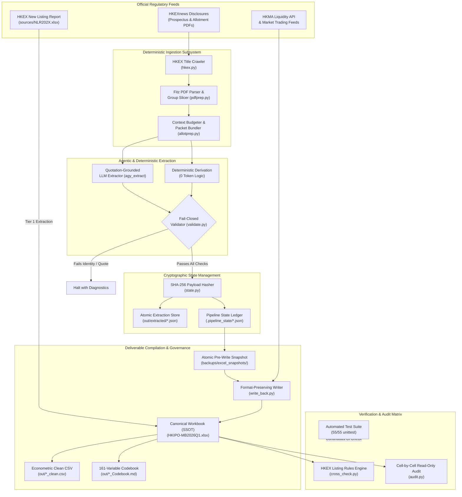

# HK IPO Data Collecting Pipeline: Systems Engineering & Governance Manual

**Document Version**: 2.1.0  
**Classification**: Engineering & Operations Standard  
**Maintainer**: Senior Systems & Data Engineering Lead  
**Last Updated**: September 2026  

---

## 1. Executive Summary & Engineering Principles

This document establishes the official systems engineering architecture, data governance protocols, cryptographic verification mechanisms, and standard operating procedures for the Hong Kong Main Board IPO dataset automation pipeline.

The pipeline automates the ingestion, parsing, extraction, deterministic validation, cross-check auditing, and Excel compilation for HKEX Main Board disclosures across 120 econometric variables.

### Core Architectural Axioms
1. **Deterministic-First (0 LLM Token Baseline)**:
   - File discovery, PDF ingestion, bookmark analysis, text slicing, balance sheet accounting identities, Listing Rules cross-checks, and Excel write-backs are **100% deterministic Python routines**.
   - LLMs are employed strictly for bounded semantic extraction from unstructured narrative text, governed by quotation-grounding schemas.
2. **Single Source of Truth (SSOT)**:
   - Data artifacts exist in strictly isolated lifecycle tiers (Raw Regulatory Sources → Working Canonical Dataset → Cryptographic Extraction Ledger → Analytical Products).
3. **Fail-Closed Verification & Hash-Gating**:
   - No data is ever written to the canonical deliverable without passing cryptographic SHA-256 state ledger checks (`extracted` → `validated` → `reviewed` → `written`).
   - Any mathematical identity violation or quotation mismatch immediately halts pipeline progression.
4. **Non-Destructive Write-Back & Instant Recovery**:
   - The write-back engine alters only designated cell values, preserving all fonts, formulas, borders, and fills.
   - Timestamped snapshots are atomically committed to `backups/excel_snapshots/` prior to any workbook modification.

---

## 2. End-to-End System Topology & Data Flow



---

## 3. Data Tiering & Lifecycle Management

The repository maintains strict boundary separation across six distinct directory layers:

| Tier | Directory | Mutability | Description & Retention Policy |
|---|---|---|---|
| **Tier 0: Templates** | `templates/` | Read-Only | Master research templates (`HKIPO-MB-template-students.xlsx`, `HKIPO-GEM-template-students.xlsx`). Never modified in production. |
| **Tier 1: Raw Sources** | `sources/` | Read-Only | Official, unedited HKEX New Listing Reports (`NLR2025_Eng.xlsx`, `NLR2026_Eng.xlsx`). Excluded from Git. |
| **Tier 2: Working Cache** | `prospectus_pipeline/data/` | Transient / Rebuildable | Downloaded statutory PDFs, page text JSONL caches, and chapter evidence packets. Excluded from Git. |
| **Tier 3: Verified Store** | `prospectus_pipeline/out/` | Hash-Signed | Authoritative extracted JSONs, cryptographic state hashes, clean CSVs, and academic codebooks. |
| **Tier 4: Canonical Dataset** | `./` (`HKIPO-MB2026Q1.xlsx`) | Governed Read/Write | The single authoritative research database. Updated solely via `write_back.py` under automated snapshot control. |
| **Tier 5: Disaster Recovery** | `backups/` | Append-Only | Timestamped full workbooks created before write operations, plus code milestones. |

---

## 4. Four-Phase Cryptographic State Machine

Every issuer extraction follows a strictly sequenced four-phase state machine:

```
[ extracted ] ──(SHA-256)──> [ validated ] ──(Inspection)──> [ reviewed ] ──(Write-Back)──> [ written ]
```

1. **State 1: Extracted (`extracted`)**:
   - The extraction output (whether agentic or deterministic) is stored at `prospectus_pipeline/out/extracted/{CODE}.json`.
   - Every single field requires:
     * `val`: Parsed typed value (float, int, string, date).
     * `source`: Verifiable verbatim quotation from the prospectus.
     * `page`: Page index where the quotation resides.
2. **State 2: Validated (`validated`)**:
   - `validate.py` executes fail-closed checks:
     * Accounting identity: `share_capital + reserves == total_equity`.
     * Offering identity: `public_offer_shares + placing_shares == total_offer_shares`.
     * Quotation verification: Confirms quotation characters exist within the raw text cache.
   - Upon success, the SHA-256 hash of the JSON payload is recorded in `.pipeline_state/{CODE}.json`.
3. **State 3: Reviewed (`reviewed`)**:
   - Senior audit or automated cross-check flags mark the company as verified for production ingestion.
4. **State 4: Written (`written`)**:
   - `write_back.py` reads the signed hash. If the on-disk JSON has been altered without re-validation, the write-back is **aborted instantly**.

---

## 5. Quality Assurance & Triple-Tier Verification Matrix

The pipeline incorporates three orthogonal defense lines to guarantee zero econometric error:

### Tier 1: Automated Unit & Regression Tests (55/55 Passed)
- **Suite**: `prospectus_pipeline/tests/`
- **Execution**: `make test` or `python3 -m unittest discover -s "Data Collecting Pipeline/prospectus_pipeline/tests" -v`
- **Coverage**:
  1. `test_audit_excel.py`: Date normalization, numeric tolerances, integer formatting, equivalence of missing data representations (`NA`, `NaN`, `None`, empty string).
  2. `test_codebook.py`: Completeness of the live 161-variable schema, summary statistics generation, CSV formatting with UTF-8 BOM.
  3. `test_cross_check.py`: HKEX Listing Rules consistency across all 38 issuers.
  4. `test_pipeline_safety.py`: Fail-closed security assertions (fake derived sources rejected, stale hashes aborted, company-level vs group-level statements filtered).
  5. `test_report.py`: Aggregation metrics, HSIC classification distribution, financial ratios.

### Tier 2: HKEX Listing Rules Cross-Checks (`cross_check.py`)
- **Execution**: `python3 run.py cross_check`
- **Invariant Rules**:
  - **Chapter 18C Valuation**: Specialist technology issuers must satisfy market cap ≥ HK$ 4.0B (2024 reform).
  - **FINI Clawback Compliance**: Strict validation of retail clawback triggers under Mechanism A (statutory 10-15x, 15-50x, 50x+) or approved Mechanism B ceilings.
  - **Over-Allotment Ceiling**: Green shoe shares must not exceed 15.00% of the initial offer shares.
  - **Cornerstone Lockup**: Verification that cornerstone investors are subject to minimum 6-month disposal restrictions.
  - **Trading Price Invariants**: Offer price must fall within `[price_low, price_high]`; first-day `low <= open/close <= high`.

### Tier 3: Cell-by-Cell Read-Only Audit (`audit.py`)
- **Execution**: `python3 run.py audit --target all`
- **Methodology**: Opens the canonical workbook in read-only mode and performs an exhaustive cell-by-cell comparison against the authorized JSON extraction ledger:
  - Total prospectus cells checked: **2,280** (38 issuers × 60 variables).
  - Total allotment cells checked: **684** (38 issuers × 18 variables).
  - Current status: **0 Excel missing, 0 JSON missing, 0 numeric differences** (100% matched).

---

## 6. Disaster Recovery & Snapshot Protocols

Data corruption prevention is hardcoded into the pipeline execution lifecycle:

1. **Pre-Write Snapshot**:
   Before modifying a single cell in `HKIPO-MB2026Q1.xlsx`, `write_back.py` automatically writes a compressed copy into:
   ```
   backups/excel_snapshots/HKIPO-MB2026Q1_backup_YYYYMMDD_HHMMSS.xlsx
   ```
2. **Instant Rollback Procedure**:
   If an unintended write or formula overwrite occurs:
   ```bash
   # 1. Identify the latest clean snapshot
   ls -lt "Data Collecting Pipeline/backups/excel_snapshots/"
   
   # 2. Restore to canonical dataset
   cp "Data Collecting Pipeline/backups/excel_snapshots/<SNAPSHOT_NAME>.xlsx" "Data Collecting Pipeline/HKIPO-MB2026Q1.xlsx"
   
   # 3. Verify integrity
   python3 run.py audit --target all
   ```
3. **Audit Log Generation**:
   Every audit, cross-check, and write-back run generates timestamped JSON and Markdown reports in `prospectus_pipeline/out/`.

---

## 7. Collaborator Standard Operating Procedures (SOP)

### Daily Pipeline Health Check
Collaborators and research assistants should execute the root master check prior to and after each work session:
```bash
make check
```
This executes:
1. `status`: Verifies extraction and write-back alignment.
2. `audit`: Confirms cell-level parity between Excel and JSON.
3. `cross_check`: Confirms zero regulatory or econometric violations.
4. `test`: Runs all 20 automated tests.

### Adding New Issuers (Ingestion Workflow)
When new IPOs are listed:
```bash
# Step 1: Discover listing documents on HKEXnews
python3 run.py find --only <CODE>.HK

# Step 2: Download official prospectus PDF
python3 run.py download --only <CODE>.HK

# Step 3: Extract text and generate bounded AI evidence packet
python3 run.py prepare --only <CODE>.HK

# Step 4: Extract semantic fields (AI agent guided by agy_extract schema)
# Output written to prospectus_pipeline/out/extracted/<CODE>.json

# Step 5: Fail-closed validation
python3 run.py validate --only <CODE>.HK

# Step 6: Safe write-back to canonical workbook (auto-snapshots)
python3 run.py write --only <CODE>.HK

# Step 7: Post-write verification
python3 run.py audit --only <CODE>.HK
python3 run.py cross_check --only <CODE>.HK
```

### Compiling Analytical Deliverables
```bash
# Export Clean Econometric CSV & Academic Codebook
python3 run.py export

# Generate Macro Market Report
python3 run.py report

# Compile Official Faculty Progress Report (.docx)
python3 run.py report-weekly
```
