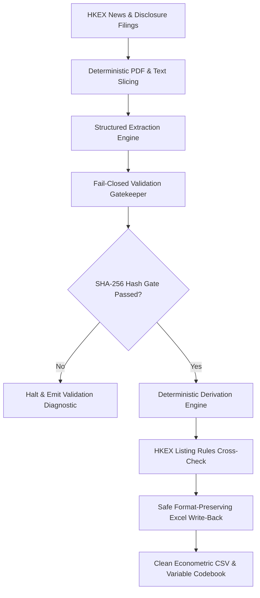

# Hong Kong Main Board IPO Pipeline & Econometric Toolkit (UROP HK IPO)

[](https://github.com/GZ-November/urop-hk-ipo/actions)
[](https://www.python.org/)
[](./Data%20Collecting%20Pipeline/prospectus_pipeline/tests)
[](#core-architecture--design-principles)
[](#core-architecture--design-principles)
[](LICENSE)

An end-to-end automated extraction, deterministic validation, cross-check auditing, and Excel workbook compilation toolkit for Hong Kong Stock Exchange (HKEX) Main Board IPO disclosures.

> **Data Privacy Notice**: This repository contains the **automated engineering pipeline, validation rules, AI agent skills, and test suites**. In accordance with research protocol, proprietary collected datasets (`.xlsx`, `.csv`, extracted company JSONs, and raw source filings) are excluded from version control via [`.gitignore`](.gitignore).

---

## Table of Contents

1. [Core Architecture & Design Principles](#core-architecture--design-principles)
2. [202-Variable Econometric Schema & Master Panel Architecture](#202-variable-econometric-schema--master-panel-architecture)
3. [Quick Start (30 Seconds)](#quick-start-30-seconds)
4. [Teammate & Collaborator Workflow](#teammate--collaborator-workflow)
5. [Empirical Econometric Analysis Guide](#empirical-econometric-analysis-guide)
6. [AI Agent Skill Integration](#ai-agent-skill-integration)
7. [Repository Layout](#repository-layout)
8. [Testing & Quality Assurance](#testing--quality-assurance)
9. [Troubleshooting & FAQ](#troubleshooting--faq)
10. [Contributing & Research References](#contributing--research-references)

---

## Core Architecture & Design Principles



1. **Deterministic-First, AI-Assisted**:
   - Document retrieval, section slicing, evidence packaging, accounting identity cross-checking, type checking, and Excel writing are 100% deterministic Python code requiring **0 LLM tokens**.
   - Semantic understanding of unstructured prospectus tables is orchestrated by AI agents with strict quotation-grounded schema requirements.
2. **Fail-Closed Verification & Cryptographic Hash-Gating**:
   - Four-stage lifecycle gates: `extracted` → `validated` → `reviewed` → `written`.
   - Each state transition is cryptographically bound to the SHA-256 hash of the exact JSON payload. Any discrepancy or unverified quote halts pipeline execution immediately.
3. **Strict Formatting Fidelity**:
   - The write-back engine populates only target cell values, preserving workbook fonts, cell fills, borders, alignments, and formulas.
   - Timestamped workbook snapshots are archived automatically prior to any write-back operation.
4. **HKEX Listing Rules Cross-Check Engine**:
   - Built-in verification for Chapter 18C market capitalization thresholds, FINI clawback schedules (Mechanisms A & B), 15% green shoe ceiling, and 6-month cornerstone lockup compliance.

---

## 202-Variable Econometric Schema & Master Panel Architecture

The canonical research workbook (`HKIPO-MB2026Q1.xlsx`, Sheet: `NLR`) contains **202 variables** structured across three standard research tiers:

| Tier | Range | Count | Primary Source | Extraction Mechanism |
|---|---|---|---|---|
| **Tier 1 (Green)** | HKEX base fields | 11 | HKEX New Listing Report | Deterministic table parser (0 Tokens) |
| **Tier 2 (Light Blue)** | Prospectus and academic fields | 77 | Statutory Prospectus Filings | PDF text slicer + agent extraction + hash-gating |
| **Tier 3 (Dark Blue)** | Allotment, macro, and academic expansion fields | 114 | Allotment announcements, market feeds, and statutory notices | Deterministic parsers, APIs, and formulas (0 Tokens) |

### Academic Expansion Dimensions (Cols 162–202, FF–GT):
- **Stabilization & Over-Allotment (Cols 162–172)**: Stabilizing manager, 30-day statutory period, price support purchases, over-allocation volume/ratio, exercise date/percentage, post-stabilization $[-5, +5]$ cliff return, 20-day return, and volume decay ratio.
- **Microstructure & Horizons (Cols 173–184)**: Day 5, Day 20, 3-month BHR and Wealth Relatives vs. HSI & HSTECH; 3-month daily turnover; 6-month Amihud illiquidity, zero-volume days, daily return volatility, and max drawdown.
- **Lockup & Unlock Schedules (Cols 185–189)**: Controlling shareholder 6M disposal & 12M control lockup dates; cornerstone unlock CAR $[-5, +5]$ & $[-20, +20]$ vs. HSI; post-unlock volume shock ratio.
- **Syndicate & Intermediaries (Cols 190–195)**: Lead sponsor name, joint sponsor count, commercial bank affiliate flags, base commission, discretionary incentive fee, and total underwriting fee rates.
- **Institutional Network (Cols 196–200)**: Cornerstone investor count, state-owned/government fund flags, crossover investor flags, Pre-IPO institutional investor counts, and state-backed flags.
- **Regulatory Regimes (Cols 201–202)**: FINI digital settlement transition flags (`POST_FINI` vs. `PRE_FINI`) and 2025 Pricing Reform flags (`POST_2025_REFORM`).

---

## Quick Start (30 Seconds)

### 1. Installation

```bash
# Clone the repository
git clone https://github.com/GZ-November/urop-hk-ipo.git
cd urop-hk-ipo

# Bootstrap environment
make env
# Or manually:
pip install -r requirements.txt
```

### 2. Standard Commands

All key operations are unified and executable directly from the repository root via `Makefile` or `python run.py`:

```bash
# Health check: status + audit + cross_check + test in a single sweep
make check

# Run all 85 automated unit and regression tests
make test

# Perform read-only cell-by-cell audit against target Excel template
make audit

# Run regulatory cross-checks (Chapter 18C, FINI, Green Shoe, Cornerstone Lockup)
make cross_check

# Generate macro market overview and research report
make report

# Export clean econometric CSV and live 202-variable academic codebook
make export

# Verify syntax & bytecode compilation
make lint
```

---

## Teammate & Collaborator Workflow

### Ingesting & Processing a New IPO Company

Teammates processing new IPO filings (e.g. for new quarters or missing issuers) can execute the end-to-end pipeline for any specific stock code (e.g. `6082.HK`):

```bash
# 1. Locate and download statutory prospectus & allotment filings from HKEX
python run.py find --only 6082.HK
python run.py download --only 6082.HK

# 2. Parse PDF pages, extract structured text, and slice key chapter packets
python run.py prepare --only 6082.HK

# 3. Interactive document search (no need to scroll 1,000 pages manually)
python run.py search outline 6082.HK
python run.py search pages 6082.HK 15-25

# 4. Validate extracted JSON against schema and exact text quotation proofs
python run.py validate --target prospectus --only 6082.HK

# 5. Safe write-back into target Excel workbook (creates automatic snapshot in backups/)
python run.py write --target prospectus --only 6082.HK --fill-missing

# 6. Process allotment results and deterministic derivations (pricing date, green shoe, free float)
python run.py allot --only 6082.HK
python run.py derive_allot --only 6082.HK
python run.py write --target allot --only 6082.HK --fill-missing

# 7. Collect external market indicators (OHLC, HIBOR, HKMA liquidity balance, 18C/18A flags)
python run.py external --only 6082.HK

# 8. Run final audit and Listing Rules cross-check
make audit
make cross_check
```

---

## Empirical Econometric Analysis Guide

The dataset generated by this pipeline is tailored for empirical corporate finance and capital market research (e.g., IPO underpricing, allocation mechanisms, and regulatory interventions).

### 1. Core Research Agendas & Hypotheses

- **IPO Underpricing & Retail Demand**:
  $$\text{Underpricing}_i = \frac{P_{i,\text{close}} - P_{i,\text{offer}}}{P_{i,\text{offer}}} = \frac{\text{col\_DH} - \text{col\_K}}{\text{col\_K}}$$
  Test how underpricing is driven by retail subscription multiples ($\ln(1 + \text{col\_CM})$), preliminary offer price revision $\frac{\text{col\_K} - \text{col\_S}}{\text{col\_T} - \text{col\_S}}$, pre-IPO 20-day Hang Seng Index momentum (`col_DD`), and market liquidity (1M HIBOR `col_DF`).
- **Cornerstone Investor Commitment**:
  Examine the certification vs. liquidity overhang effects of cornerstone allocation ratios (`col_CK`), 6-month statutory lockups (`col_CL` - `col_E`), and public free float (`col_DA`).
- **HKEX Listing Regime Reforms**:
  Evaluate pricing efficiency across Chapter 18C specialist technology issuers (`col_BM`), Chapter 18A biotech issuers (`col_BL`), and FINI digital clawback mechanisms (`col_DN`: Mechanism A statutory schedule vs. Mechanism B discretionary ceiling).

### 2. Analytical Workflows (Python & Stata)

Run `make export` to obtain the pure econometric dataset `HKIPO-MB2026Q1_clean.csv` (UTF-8 with BOM, standard ISO dates, no merged headers):

#### Python (`pandas` + `statsmodels`)
```python
import numpy as np
import pandas as pd
import statsmodels.formula.api as smf

df = pd.read_csv("Data Collecting Pipeline/prospectus_pipeline/out/HKIPO-MB2026Q1_clean.csv")

# Variable transformation
df["underpricing"] = (df["col_DH"] - df["col_K"]) / df["col_K"]
df["ln_sub_mult"] = np.log1p(df["col_CM"])
df["cornerstone_ratio"] = df["col_CK"] / 100.0
df["hsi_momentum"] = df["col_DD"]
df["hibor_1m"] = df["col_DF"]
df["is_18c"] = df["col_BM"].fillna(0).astype(int)
df["sector"] = df["col_BN"].astype(str).str[:2]  # HSICS 2-digit industry

# OLS regression with HC3 robust standard errors
model = smf.ols(
    "underpricing ~ ln_sub_mult + cornerstone_ratio + hsi_momentum + hibor_1m + is_18c + C(sector)",
    data=df
).fit(cov_type="HC3")
print(model.summary())
```

#### Stata (`.do` script)
```stata
* Import clean CSV dataset
import delimited "out/HKIPO-MB2026Q1_clean.csv", clear bindquote(strict) varnames(1)

* Construct empirical variables
gen underpricing = (col_dh - col_k) / col_k
gen ln_sub_mult = ln(1 + col_cm)
gen cornerstone_pct = col_ck
gen hsi_20d = col_dd
gen hibor_1m = col_df
gen tech_18c = (col_bm == 1)
gen ind2 = substr(string(col_bn, "%06.0f"), 1, 2)
destring ind2, replace

* Baseline OLS regression with robust standard errors
regress underpricing ln_sub_mult cornerstone_pct hsi_20d hibor_1m tech_18c i.ind2, vce(robust)
```

For the complete econometric methodology and model specifications, see the [Empirical Analysis Guide](.agents/skills/hk-ipo-pipeline/references/empirical_analysis_guide.md).

---

## AI Agent Skill Integration

This repository includes a standardized skill package compatible with AI coding agents (Antigravity, Claude Code, Cursor):

- **Skill Location**: [`.agents/skills/hk-ipo-pipeline/`](.agents/skills/hk-ipo-pipeline/)
- **Specification**: [`SKILL.md`](.agents/skills/hk-ipo-pipeline/SKILL.md)
- **Features**:
  - **Self-Healing Environment** ([`check_env.sh`](.agents/skills/hk-ipo-pipeline/scripts/check_env.sh)): Detects Python runtime and auto-installs missing dependencies (`openpyxl`, `pyyaml`, `requests`, `pymupdf`).
  - **Universal Runner** ([`run_pipeline.sh`](.agents/skills/hk-ipo-pipeline/scripts/run_pipeline.sh)): Invokes pipeline subcommands safely from any working directory.
  - **Troubleshooting SOP**: Automated runbook for `VALIDATION_ERROR` and `HASH_MISMATCH` exceptions.

---

## Repository Layout

```text
.
├── Makefile                                # Unified project automation entry point
├── run.py                                  # Top-level CLI dispatcher
├── pyproject.toml                          # Project configuration & package metadata
├── requirements.txt                        # Core runtime & analysis dependencies
├── README.md                               # Project documentation & guides
├── CONTRIBUTING.md                         # Contribution & development standards
├── SECURITY.md                             # Data privacy policy
├── LICENSE                                 # MIT License
├── .editorconfig                           # IDE & code formatting consistency
├── .gitignore                              # Data isolation rules (strictly excludes .xlsx/.csv/out)
│
├── .github/
│   └── workflows/
│       └── ci.yml                          # Multi-OS & multi-Python version CI testing
│
├── .agents/skills/hk-ipo-pipeline/         # AI Agent skill package
│   ├── SKILL.md                            # Agent SOP and workflow guide
│   ├── scripts/                            # Self-healing environment and runners
│   │   ├── check_env.sh                    # Environment probe
│   │   └── run_pipeline.sh                 # Universal CLI wrapper
│   └── references/                         # Empirical and regulatory reference manuals
│       ├── empirical_analysis_guide.md     # Econometric models & Python/Stata guides
│       ├── listing_rules_guide.md          # HKEX Main Board Listing Rules thresholds
│       └── variable_codebook_overview.md   # Econometric schema overview
│
└── Data Collecting Pipeline/               # Unified Data Collection Subsystem
    ├── README.md                           # Subsystem quick reference & operational guide
    ├── SYSTEM_MANAGEMENT.md                # Systems Engineering & Governance Manual
    ├── HKIPO-MB2026Q1.xlsx                 # Canonical target dataset (Single Source of Truth)
    │
    ├── templates/                          # Blank collection templates
    │   ├── HKIPO-GEM-template-students.xlsx
    │   └── HKIPO-MB-template-students.xlsx
    │
    ├── sources/                            # Immutable HKEX regulatory sources
    │   ├── NLR2025_Eng.xlsx
    │   └── NLR2026_Eng.xlsx
    │
    ├── docs/                               # Engineering specs, manuals & rule tables
    │   ├── specs/                          # Schemas, construction manuals, rule tables
    │   ├── guides/                         # Student & field collection guides
    │   └── reports/                        # Cost & feasibility reports
    │
    ├── reports/                            # Academic progress reports & compilers
    │   ├── build_weekly_report.py          # Progress report generator (.docx)
    │   └── Weekly_Research_Progress_Report_HKIPO_2026Q1.docx
    │
    ├── backups/                            # Automated snapshot archives & recovery
    │   ├── excel_snapshots/                # Pre-write timestamped snapshots
    │   └── code_archives/                  # Historical checkpoints
    │
    └── prospectus_pipeline/                # Automated Extraction Engine
        ├── run.py                          # Subsystem CLI Dispatcher
        ├── config.yaml                     # Engine Configuration
        ├── pyproject.toml                  # Engine Package Metadata
        ├── requirements.txt                # Engine Dependencies
        ├── README.md                       # Engine Technical Manual
        ├── src/                            # Core extraction, validation & write modules
        ├── tools/                          # Domain CLI utilities (search, flags, HKMA)
        ├── schema/                         # Field contracts (fields.json, allot_fields.json, relational_schemas.json)
        ├── prompts/                        # LLM Extraction schemas & few-shot instructions
        ├── workflows/                      # Extraction workflows
        ├── tests/                          # Automated test suite (85/85 Passed)
        ├── data/                           # PDF store, page text & evidence packets
        └── out/                            # Verifiable state ledger, clean CSV & Codebook
```

---

## Testing & Quality Assurance

Run the automated test suite locally:

```bash
make test
# Or with verbose detail:
python3 -m unittest discover -s "Data Collecting Pipeline/prospectus_pipeline/tests" -v
```

Test coverage includes:
- **Zero Write Violation**: Auditing and verification functions operate strictly read-only.
- **Float Tolerance & Null Equivalence**: Handles numeric rounding, zero values, and empty strings safely.
- **Chapter 18C & FINI Compliance**: Validates regulatory threshold rules for specialized technology companies.
- **Security & Integrity**: Prohibits unverified quotes, negative share counts, and out-of-bounds percentages.

---

## Troubleshooting & FAQ

| Symptom / Question | Root Cause | Recommended Action |
|---|---|---|
| `VALIDATION_ERROR: quote not found` | The quotation string in the extracted JSON does not match the PDF verbatim. | Run `python run.py search pages <CODE>.HK <P1>-<P2>` to inspect original text and correct JSON. |
| `HASH_MISMATCH` | The extracted JSON was modified after the validation step. | Re-run `python run.py validate --target prospectus [--only <CODE>.HK]` to generate a new valid SHA-256 signature. |
| Missing Python packages | Dependencies not installed in local virtual environment. | Run `make env` to automatically verify and install dependencies. |
| Accidental Excel write error | Unexpected write to wrong cell or column. | Revert immediately to the timestamped snapshot automatically saved in `backups/excel_snapshots/`. |

---

## Contributing & Research References

- **Contributing**: Please review [`CONTRIBUTING.md`](CONTRIBUTING.md) before submitting pull requests.
- **Data Privacy**: Refer to [`SECURITY.md`](SECURITY.md).
- **Literature References**:
  - Lowry, M., Michaely, R., & Volkova, E. (2017). *Initial Public Offerings: A Synthesis of the Literature and Directions for Future Research*. Foundations and Trends® in Finance, 11(3–4), 154–320.
  - Rock, K. (1986). *Why new issues are underpriced*. Journal of Financial Economics, 15(1–2), 187–212.
  - Hong Kong Exchanges and Clearing Limited (HKEX). *Rules Governing the Listing of Securities on The Stock Exchange of Hong Kong Limited* (Main Board Listing Rules, Chapter 18A, 18C, and FINI Framework).
