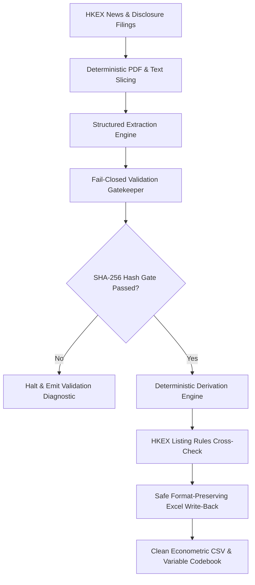

# Hong Kong Main Board IPO Pipeline & Econometric Toolkit (UROP HK IPO)

[](https://www.python.org/)
[](./Data%20Collecting%20Templates/News/prospectus_pipeline/tests)
[](#core-architecture--design-principles)
[](#core-architecture--design-principles)
[](LICENSE)

An end-to-end automated extraction, deterministic validation, cross-check auditing, and Excel workbook compilation toolkit for Hong Kong Stock Exchange (HKEX) Main Board IPO disclosures.

> **Note on Data Privacy**: This repository contains the **automated engineering pipeline, validation rules, AI agent skills, and test suites**. In accordance with research protocol, proprietary collected datasets (`.xlsx`, `.csv`, extracted JSONs, and raw source filings) are excluded from version control.

---

## Core Architecture & Design Principles



1. **Deterministic-First, AI-Assisted**:
   - Document retrieval, section slicing, evidence packaging, accounting identity cross-checking, type checking, and Excel writing are 100% deterministic Python code requiring **0 LLM tokens**.
   - Semantic understanding of unstructured prospectus tables is orchestrated by AI agents with strict quotation-grounded schema requirements.
2. **Fail-Closed Verification & Cryptographic Hash-Gating**:
   - Four-stage lifecycle gates: `extracted` → `validated` → `reviewed` → `written`.
   - Each state transition is cryptographically bound to the SHA-256 hash of the exact JSON payload. Any discrepancy or unverified quote halts pipeline execution immediately.
3. **Strict Formatting Fidelity**:
   - The write-back engine populates only target cell values, preserving workbook fonts, cell fills, borders, alignments, and formulas.
   - Timestamped workbook snapshots are archived automatically prior to any write-back operation.
4. **HKEX Listing Rules Cross-Check Engine**:
   - Built-in verification for Chapter 18C market capitalization thresholds, FINI clawback schedules (Mechanisms A & B), 15% green shoe ceiling, and 6-month cornerstone lockup compliance.

---

## 120-Variable Econometric Schema

The pipeline extracts and verifies 120 variables structured across three standard research tiers:

| Tier | Range | Count | Primary Source | Extraction Mechanism |
|---|---|---|---|---|
| **Tier 1 (Green)** | Col A–K | 11 | HKEX New Listing Report | Deterministic table parser (0 Tokens) |
| **Tier 2 (Light Blue)** | Col L–AY, DP, CJ, BA–CI | 60 | Statutory Prospectus Filings | PDF text slicer + agent extraction + hash-gating |
| **Tier 3 (Dark Blue)** | Col CK, CM–DC | 18 | Allotment Results Announcements | Allotment parser + deterministic formulas |
| **Tier 3 (Dark Blue)** | Col DD–DO, DF/DG | 31 | Market Trading & Macro Indicators | Offline feeds, HKMA API, and regulatory rules |

---

## Quick Start

### Prerequisites

- macOS / Linux
- Python 3.9+

Install dependencies:
```bash
make env
# Or manually:
pip install openpyxl pyyaml requests pymupdf
```

### Standard Commands

All key operations are accessible via the root `Makefile`:

```bash
# 1. Run complete health check (status, audit, cross_check, and test suite)
make check

# 2. Run all 17 automated unit and regression tests
make test

# 3. Perform cell-by-cell read-only audit against target Excel template
make audit

# 4. Run regulatory cross-checks (Chapter 18C, FINI, Green Shoe, Cornerstone Lockup)
make cross_check

# 5. Generate macro market overview and research report
make report

# 6. Export clean econometric CSV and variable codebook
make export
```

### Teammate Workflow: Ingesting & Processing a New IPO Company

Teammates working on extracting new IPOs can run the full toolchain end-to-end for any specific company (e.g., `6082.HK`):

```bash
# 1. Locate and download statutory prospectus & allotment filings from HKEX
python3 Data\ Collecting\ Templates/News/prospectus_pipeline/run.py find --only 6082.HK
python3 Data\ Collecting\ Templates/News/prospectus_pipeline/run.py download --only 6082.HK

# 2. Parse PDF pages, extract structured text, and slice key chapter packets
python3 Data\ Collecting\ Templates/News/prospectus_pipeline/run.py prepare --only 6082.HK

# 3. Fast interactive search inside prospectus sections (no need to scroll 1,000 pages manually)
python3 Data\ Collecting\ Templates/News/prospectus_pipeline/run.py search outline 6082.HK
python3 Data\ Collecting\ Templates/News/prospectus_pipeline/run.py search pages 6082.HK 15-25

# 4. Validate extracted JSON against schema and exact text quotation proofs
python3 Data\ Collecting\ Templates/News/prospectus_pipeline/run.py validate --target prospectus --only 6082.HK

# 5. Safe write-back into target Excel workbook (creates automatic snapshot in backups/)
python3 Data\ Collecting\ Templates/News/prospectus_pipeline/run.py write --target prospectus --only 6082.HK --fill-missing

# 6. Process allotment results and deterministic derivations (pricing date, green shoe, free float)
python3 Data\ Collecting\ Templates/News/prospectus_pipeline/run.py allot --only 6082.HK
python3 Data\ Collecting\ Templates/News/prospectus_pipeline/run.py derive_allot --only 6082.HK
python3 Data\ Collecting\ Templates/News/prospectus_pipeline/run.py write --target allot --only 6082.HK --fill-missing

# 7. Collect external market indicators (OHLC, HIBOR, HKMA liquidity balance, 18C/18A flags)
python3 Data\ Collecting\ Templates/News/prospectus_pipeline/run.py external --only 6082.HK

# 8. Run final audit and Listing Rules cross-check
make audit
make cross_check
```

---

## Empirical Econometric Analysis Guide

The dataset generated by this pipeline is tailored for empirical corporate finance and capital market research (e.g., IPO underpricing, allocation mechanisms, and regulatory interventions).

### 1. Core Research Agendas & Hypotheses

- **IPO Underpricing & Retail Demand**:
  $$\text{Underpricing}_i = \frac{P_{i,\text{close}} - P_{i,\text{offer}}}{P_{i,\text{offer}}} = \frac{\text{col\_DH} - \text{col\_K}}{\text{col\_K}}$$
  Test how underpricing is driven by retail subscription multiples ($\ln(1 + \text{col\_CM})$), preliminary offer price revision $\frac{\text{col\_K} - \text{col\_S}}{\text{col\_T} - \text{col\_S}}$, pre-IPO 20-day Hang Seng Index momentum (`col_DD`), and market liquidity (1M HIBOR `col_DF`).
- **Cornerstone Investor Commitment**:
  Examine the certification vs. liquidity overhang effects of cornerstone allocation ratios (`col_CK`), 6-month statutory lockups (`col_CL` - `col_E`), and public free float (`col_DA`).
- **HKEX Listing Regime Reforms**:
  Evaluate pricing efficiency across Chapter 18C specialist technology issuers (`col_BM`), Chapter 18A biotech issuers (`col_BL`), and FINI digital clawback mechanisms (`col_DN`: Mechanism A statutory schedule vs. Mechanism B discretionary ceiling).

### 2. Analytical Workflows (Python & Stata)

Run `make export` to obtain the pure econometric dataset `HKIPO-MB2026Q1_clean.csv` (UTF-8 with BOM, standard ISO dates, no merged headers):

#### Python (`pandas` + `statsmodels`)
```python
import numpy as np
import pandas as pd
import statsmodels.formula.api as smf

df = pd.read_csv("Data Collecting Templates/News/prospectus_pipeline/out/HKIPO-MB2026Q1_clean.csv")

# Variable transformation
df["underpricing"] = (df["col_DH"] - df["col_K"]) / df["col_K"]
df["ln_sub_mult"] = np.log1p(df["col_CM"])
df["cornerstone_ratio"] = df["col_CK"] / 100.0
df["hsi_momentum"] = df["col_DD"]
df["hibor_1m"] = df["col_DF"]
df["is_18c"] = df["col_BM"].fillna(0).astype(int)
df["sector"] = df["col_BN"].astype(str).str[:2]  # HSICS 2-digit industry

# OLS regression with HC3 robust standard errors
model = smf.ols(
    "underpricing ~ ln_sub_mult + cornerstone_ratio + hsi_momentum + hibor_1m + is_18c + C(sector)",
    data=df
).fit(cov_type="HC3")
print(model.summary())
```

#### Stata (`.do` script)
```stata
* Import clean CSV dataset
import delimited "out/HKIPO-MB2026Q1_clean.csv", clear bindquote(strict) varnames(1)

* Construct empirical variables
gen underpricing = (col_dh - col_k) / col_k
gen ln_sub_mult = ln(1 + col_cm)
gen cornerstone_pct = col_ck
gen hsi_20d = col_dd
gen hibor_1m = col_df
gen tech_18c = (col_bm == 1)
gen ind2 = substr(string(col_bn, "%06.0f"), 1, 2)
destring ind2, replace

* Baseline OLS regression with robust standard errors
regress underpricing ln_sub_mult cornerstone_pct hsi_20d hibor_1m tech_18c i.ind2, vce(robust)
```

For the complete econometric methodology and model specifications, see the [Empirical Analysis Guide](file:///.agents/skills/hk-ipo-pipeline/references/empirical_analysis_guide.md).

---

## AI Agent Skill Integration

This repository includes a standardized skill package compatible with AI coding agents (Antigravity, Claude Code, Cursor):

- **Skill Location**: [`.agents/skills/hk-ipo-pipeline/`](file:///.agents/skills/hk-ipo-pipeline/)
- **Specification**: [`SKILL.md`](file:///.agents/skills/hk-ipo-pipeline/SKILL.md)
- **Features**:
  - **Self-Healing Environment** ([`check_env.sh`](file:///.agents/skills/hk-ipo-pipeline/scripts/check_env.sh)): Detects Python runtime and auto-installs missing dependencies (`openpyxl`, `pyyaml`, `requests`, `pymupdf`).
  - **Universal Runner** ([`run_pipeline.sh`](file:///.agents/skills/hk-ipo-pipeline/scripts/run_pipeline.sh)): Invokes pipeline subcommands safely from any working directory.
  - **Troubleshooting SOP**: Automated runbook for `VALIDATION_ERROR` and `HASH_MISMATCH` exceptions.

---

## Repository Layout

```text
.
├── Makefile                                # Unified project automation entry point
├── README.md                               # Project documentation
├── LICENSE                                 # MIT License
├── .gitignore                              # Data isolation and version control ignore rules
│
├── .agents/skills/hk-ipo-pipeline/         # AI Agent skill package
│   ├── SKILL.md                            # Agent SOP and workflow guide
│   ├── scripts/                            # Self-healing environment and runners
│   │   ├── check_env.sh                    # Environment probe
│   │   └── run_pipeline.sh                 # Universal CLI wrapper
│   └── references/                         # Empirical and regulatory reference manuals
│       ├── empirical_analysis_guide.md     # Econometric models & Python/Stata guides
│       ├── listing_rules_guide.md          # HKEX Main Board Listing Rules thresholds
│       └── variable_codebook_overview.md   # 120-variable econometric schema
│
└── Data Collecting Templates/News/
    └── prospectus_pipeline/                # Core automated pipeline package
        ├── run.py                          # Unified CLI entry point
        ├── config.yaml                     # Pipeline configuration
        ├── requirements.txt                # Python dependencies
        ├── pyproject.toml                  # Package metadata
        ├── README.md                       # Pipeline technical manual
        │
        ├── src/                            # Core business logic
        │   ├── audit.py                    # Read-only cell-by-cell Excel auditing
        │   ├── cross_check.py              # HKEX Listing Rules verification engine
        │   ├── report.py                   # Academic market report generator
        │   ├── codebook.py                 # Econometric codebook & CSV exporter
        │   ├── auto_fill.py                # Pipeline scheduler and status monitor
        │   ├── contracts.py                # Strict schema and quotation contracts
        │   ├── state.py                    # Four-phase hash-signed state management
        │   ├── storage.py                  # Atomic JSON storage engine
        │   ├── validate.py                 # Deterministic structural and identity validator
        │   ├── write_back.py               # Safe Excel writer with automatic snapshots
        │   ├── pricing_date.py             # Pricing date deterministic derivation
        │   ├── pdfprep.py                  # PDF text extraction and section packaging
        │   ├── allotprep.py                # Allotment results text slicing
        │   ├── greenshoe.py                # Over-allotment option crawler
        │   ├── cornerstone.py              # Cornerstone investor audit
        │   └── hkex.py                     # HKEX News announcement client
        │
        ├── tools/                          # Domain utilities
        │   ├── search.py                   # Document search CLI
        │   ├── state.py                    # State certification CLI
        │   └── external/                   # Market, HKMA, and regulatory flag tools
        │
        ├── schema/                         # Strict contract definitions
        │   ├── fields.json                 # 60 prospectus field specifications
        │   └── allot_fields.json           # 18 allotment field specifications
        │
        ├── tests/                          # 17 automated tests
        │   ├── test_audit_excel.py         # Read-only audit & float tolerance tests
        │   ├── test_cross_check.py         # Listing Rules & clawback tests
        │   ├── test_report.py              # Academic report generation tests
        │   ├── test_codebook.py            # Codebook builder & clean CSV tests
        │   └── test_pipeline_safety.py     # Hash-gating & security regression tests
        │
        └── workflows/                      # Extraction workflow definitions
            ├── prospectus_extract.js       # Prospectus extraction workflow
            └── allot_extract.js            # Allotment extraction workflow
```

---

## Testing & Quality Assurance

Run the automated test suite with verbose output:

```bash
python3 -m unittest discover -s "Data Collecting Templates/News/prospectus_pipeline/tests" -v
```

Test coverage includes:
- **Zero Write Violation**: Auditing and verification functions operate strictly read-only.
- **Float Tolerance & Null Equivalence**: Handles numeric rounding, zero values, and empty strings safely.
- **Chapter 18C & FINI Compliance**: Validates regulatory threshold rules for specialized technology companies.
- **Security & Integrity**: Prohibits unverified quotes, negative share counts, and out-of-bounds percentages.

---

## Research References

- Lowry, M., Michaely, R., & Volkova, E. (2017). *Initial Public Offerings: A Synthesis of the Literature and Directions for Future Research*. Foundations and Trends® in Finance, 11(3–4), 154–320.
- Hong Kong Exchanges and Clearing Limited (HKEX). *Rules Governing the Listing of Securities on The Stock Exchange of Hong Kong Limited* (Main Board Listing Rules, Chapter 18A, 18C, and FINI Framework).
