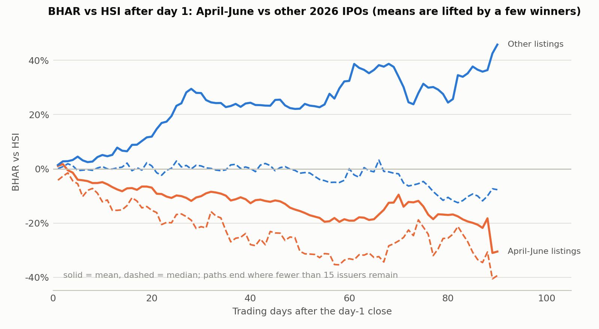

# Aftermarket returns of 2026 IPOs from daily bars (113 of 113 issuers, last bar 2026-09-30)

Bars are the cached Tencent series in `data/market/aftermarket`; benchmark returns are aligned to each issuer's own bar dates.
Issuers have between 0 and 183 trading days after listing, so long horizons cover
earlier listings only (N shown per row). "Hot" = listed April-June (calendar dummy used throughout the analysis).

## Reading

- Event time, treating each IPO as independent, shows a large hot-vs-other gap that grows with the horizon. With listing-month clustering
  it is weaker (day-60 wild cluster p = 0.047); the ordinary Mann-Whitney and HC3 p-values overstate it.
- Calendar time, which counts each date once, gives the April-June portfolio an excess return not distinguishable from zero (p = 0.50), the other
  listings a positive excess return (p = 0.063), and no significant difference between them (p = 0.27).
- These estimates compare different listing windows and market paths. Read the BH-adjusted headline tests below before claiming a hot-window reversal;
  calendar-time point estimates alone do not establish that either portfolio has a nonzero abnormal return.

## 1. Event time: BHAR from the day-1 close, benchmark HSI

| Trading days after day 1 | N (hot / other) | Mean BHAR | Median BHAR | Mean difference | HC3 p | Wild cluster p (9 months) | Mann-Whitney p |
|---|---|---|---|---|---|---|---|
| 5 | 45 / 63 | -4.0% / 4.5% | -5.5% / -0.6% | -8.5 pp | 0.067 | 0.141 | 0.032 |
| 20 | 45 / 57 | -6.9% / 11.9% | -15.3% / 1.1% | -18.8 pp | 0.028 | 0.160 | 0.007 |
| 40 | 45 / 53 | -12.7% / 24.4% | -27.9% / 0.1% | -37.0 pp | 0.009 | 0.062 | 0.002 |
| 60 | 45 / 43 | -19.1% / 32.4% | -33.1% / 0.0% | -51.5 pp | 0.008 | 0.047 | 0.000 |
| 90 | 17 / 37 | -30.5% / 45.8% | -39.3% / -7.7% | -76.3 pp | 0.008 | 0.250 | 0.004 |

- Inference: HC3 ignores clustering; the wild cluster p uses exact enumeration over listing months (the hot dummy is constant within a month,
  so only 9 clusters, 3 treated, identify the difference; it is the appropriate but low-power test). Mann-Whitney ignores clustering.
- Horizons mix calendar windows: the 90-day "other" group is mostly January-March listings, whose window overlaps the April-June rally.

Same table, benchmark HSTECH:

| Trading days after day 1 | N (hot / other) | Mean BHAR | Median BHAR | Mean difference | HC3 p | Wild cluster p (9 months) | Mann-Whitney p |
|---|---|---|---|---|---|---|---|
| 5 | 45 / 63 | -4.6% / 5.6% | -7.2% / 1.5% | -10.2 pp | 0.031 | 0.102 | 0.007 |
| 20 | 45 / 57 | -6.2% / 15.6% | -18.4% / 2.7% | -21.8 pp | 0.010 | 0.039 | 0.002 |
| 40 | 45 / 53 | -9.7% / 30.3% | -21.8% / 6.6% | -40.0 pp | 0.005 | 0.031 | 0.000 |
| 60 | 45 / 43 | -13.7% / 38.6% | -26.6% / 4.9% | -52.3 pp | 0.007 | 0.047 | 0.000 |
| 90 | 17 / 37 | -23.6% / 51.1% | -32.7% / -3.1% | -74.7 pp | 0.010 | 0.250 | 0.006 |

## 2. Calendar time: equal-weighted portfolios in days 1-60 after listing

Each date's portfolio averages the excess return of all issuers in their first 60 trading days after day 1, requires at least
5 issuers, and uses Newey-West standard errors (10 lags). This treats overlapping same-window IPOs as one observation per date.

Benchmark HSI:

| Portfolio | Days | Mean issuers/day | Excess return, bp/day | NW t (p) | CAPM alpha, bp/day | CAPM beta | CAPM alpha NW t (p) |
|---|---|---|---|---|---|---|---|
| April-June listings | 104 | 26 | -18.6 | -0.67 (0.502) | -19.7 | 0.59 | -0.76 (0.446) |
| Other listings | 173 | 19 | 33.0 | 1.86 (0.063) | 33.3 | 1.04 | 1.90 (0.057) |
| Hot minus other (dates with both) | 99 | — | -31.9 | -1.10 (0.271) | — | — | — |

Benchmark HSTECH:

| Portfolio | Days | Mean issuers/day | Excess return, bp/day | NW t (p) | CAPM alpha, bp/day | CAPM beta | CAPM alpha NW t (p) |
|---|---|---|---|---|---|---|---|
| April-June listings | 104 | 26 | -13.8 | -0.49 (0.626) | -16.3 | 0.66 | -0.62 (0.534) |
| Other listings | 173 | 19 | 45.3 | 2.61 (0.009) | 41.5 | 0.80 | 2.36 (0.018) |
| Hot minus other (dates with both) | 99 | — | -31.9 | -1.10 (0.271) | — | — | — |

- Alpha is per trading day in basis points (100 bp = 1%). The "Other" portfolio is largely January-March listings, so it and the hot portfolio face different market paths;
  the CAPM columns control the common market move but not a different sentiment regime.
- Calendar-time p-values are typically much larger than event-time ones because they count each date once.

## 3. Multiplicity

| Test | p | q (BH) |
|---|---|---|
| BHAR vs HSI, day 20: hot minus other (wild cluster) | 0.1602 | 0.2669 |
| BHAR vs HSI, day 60: hot minus other (wild cluster) | 0.0469 | 0.1563 |
| Calendar-time alpha vs HSI, April-June listings | 0.5023 | 0.5023 |
| Calendar-time alpha vs HSI, Other listings | 0.0625 | 0.1563 |
| Calendar-time spread, hot minus other, vs HSI | 0.2711 | 0.3389 |

The comparisons above are the headline aftermarket claims; the earlier Mann-Whitney p-values in `analysis/out/extended/` correspond to the event-time design without clustering.
