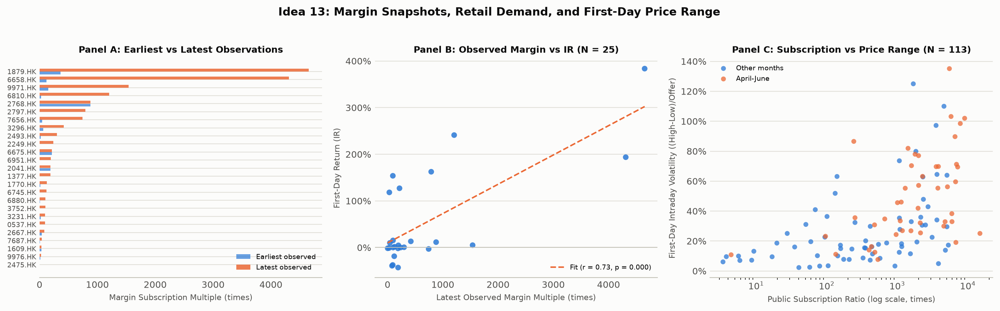

# Margin Snapshots & Retail Demand, 2026 (Idea 13)

Closing-day snapshot sensitivity: N = 15, coefficient = 0.150, HC3 p = 0.473. G = 4; maximum leverage = 0.586; status = estimated. HC3 estimability does not ensure reliable inference with few/unbalanced listing-month clusters. A closing-day snapshot is not necessarily available before the subscription/pricing decision. Non-closing observations are censored and differ in time to deadline.

## Coverage and information timing

Only 25 of 113 issuers have any source-reported margin snapshot; coverage depends on which listings media surveys happened to report, so conclusions apply to covered issuers and may not generalise to the rest. Differences between covered and uncovered issuers (descriptive, Mann-Whitney, not a selection model):

| variable | n_with_margin | mean_with_margin | n_without_margin | mean_without_margin | mann_whitney_p |
|---|---|---|---|---|---|
| log(1+IR) | 25 | 0.246 | 88 | 0.317 | 0.285 |
| ln official public subscription ratio | 25 | 6.414 | 88 | 6.451 | 0.691 |
| ln proceeds (HK$) | 25 | 0.430 | 88 | 0.497 | 0.648 |

Issuers with a source by listing month:

| month | issuers | with_margin | share_with_margin |
|---|---|---|---|
| 2026-01 | 12 | 0 | 0.00 |
| 2026-02 | 11 | 1 | 0.09 |
| 2026-03 | 15 | 0 | 0.00 |
| 2026-04 | 8 | 4 | 0.50 |
| 2026-05 | 13 | 1 | 0.08 |
| 2026-06 | 24 | 2 | 0.08 |
| 2026-07 | 16 | 14 | 0.88 |
| 2026-08 | 2 | 0 | 0.00 |
| 2026-09 | 12 | 3 | 0.25 |

Publication timing of the 93 observations (articles are posted after the market closes; a closing-day article was published after the 12:00 subscription deadline):

| availability | observations |
|---|---|
| yes_published_before_closing_day | 78 |
| no_after_deadline | 13 |
| unknown_closing_day_time_missing | 2 |

### Latest snapshot demonstrably public before the subscription deadline

| Specification | Coefficient (HC3 s.e.) | HC3 p | Wild cluster p | N | G | Max leverage | Status |
|---|---|---|---|---|---|---|---|
| ln latest pre-deadline snapshot | 0.147 (0.085) | 0.084 | 0.250 | 25 | 6 | 0.317 | estimated |
| + April-June window | 0.083 (0.056) | 0.136 | 0.281 | 25 | 6 | 0.321 | estimated |
| + window + ln size | 0.072 (0.082) | 0.384 | 0.531 | 25 | 6 | 0.393 | estimated |

These are the same exploratory associations on a smaller, selected sample with 6 listing months; estimable HC3 does not make the inference reliable and the wild bootstrap cannot create independent months.

## 1. Broker Margin Financing Panel (N = 25 issuers)

Source-reported broker-survey snapshots cover 25 of 113 issuers (93 observations). Only 15 have a snapshot on the subscription closing date. No missing dates are interpolated. These are media-reported survey amounts, not audited market-wide totals.
- **Rank correlation** of latest observed margin multiple with first-day return (IR): $\rho = 0.46$ ($p = 0.020$).
- **Observed growth** in 20 issuers with multiple dates and a constant named survey scope: mean **41.59x**, median **16.80x**. Endpoint growth does not establish acceleration, exponential growth or herding. Broker membership within a news survey remains unspecified.

### Latest Observed Margin Multiple vs First-Day Return (IR)

| Specification | Coefficient (HC3 s.e.) | HC3 p | Wild cluster p | N |
|---|---|---|---|---|
| ln latest observed margin multiple | 0.161* (0.083) | 0.051 | 0.250 | 25 |
| + April-June window | 0.091 (0.060) | 0.129 | 0.156 | 25 |
| + window + ln size | 0.082 (0.073) | 0.265 | 0.219 | 25 |

### Growth Between Observed Endpoints

| Stock Code | Latest Observed Multiple | Earliest Observed Multiple | days | first_date | last_date | Earliest Margin (B HKD) | Latest Margin (B HKD) | on_close | comparable_scope | pre_deadline_n | pre_deadline_last_multiple | pre_deadline_last_date | unknown_timing_n | Observed Growth Ratio |
|---|---|---|---|---|---|---|---|---|---|---|---|---|---|---|
| 0537.HK | 94.0x | 3.3x | 5 | 2026-06-30 00:00:00 | 2026-07-06 00:00:00 | 0.4 | 10.7 | True | True | 4 | 28.059297784155504 | 2026-07-03 00:00:00 | 0 | 28.47x |
| 1377.HK | 188.6x | 4.5x | 5 | 2026-06-30 00:00:00 | 2026-07-06 00:00:00 | 2.2 | 90.5 | True | True | 4 | 51.00663311222959 | 2026-07-03 00:00:00 | 0 | 41.76x |
| 1770.HK | 127.0x | 12.1x | 4 | 2026-06-29 00:00:00 | 2026-07-02 00:00:00 | 0.6 | 6.6 | False | True | 4 | 126.95570667833576 | 2026-07-02 00:00:00 | 0 | 10.52x |
| 1879.HK | 4653.3x | 363.1x | 4 | 2026-04-20 00:00:00 | 2026-04-23 00:00:00 | 45.9 | 588.0 | True | True | 3 | 2876.5867105262955 | 2026-04-22 00:00:00 | 0 | 12.82x |
| 2249.HK | 235.6x | 1.2x | 6 | 2026-06-30 00:00:00 | 2026-07-07 00:00:00 | 0.8 | 164.5 | True | True | 5 | 44.95721481016977 | 2026-07-06 00:00:00 | 0 | 200.91x |
| 2475.HK | 2.5x | 0.7x | 5 | 2026-06-30 00:00:00 | 2026-07-06 00:00:00 | 1.7 | 5.9 | True | True | 4 | 1.6475610954473665 | 2026-07-03 00:00:00 | 0 | 3.51x |
| 2493.HK | 298.8x | 18.1x | 4 | 2026-04-20 00:00:00 | 2026-04-23 00:00:00 | 2.6 | 43.2 | True | True | 3 | 133.00873637748592 | 2026-04-22 00:00:00 | 1 | 16.49x |
| 2667.HK | 81.3x | 41.8x | 3 | 2026-06-29 00:00:00 | 2026-07-01 00:00:00 | 2.8 | 5.5 | False | True | 3 | 81.30813034403494 | 2026-07-01 00:00:00 | 0 | 1.95x |
| 2797.HK | 790.3x | 3.5x | 5 | 2026-06-30 00:00:00 | 2026-07-06 00:00:00 | 0.1 | 15.8 | True | True | 4 | 106.35 | 2026-07-03 00:00:00 | 0 | 225.79x |
| 3296.HK | 421.4x | 64.7x | 2 | 2026-04-17 00:00:00 | 2026-04-20 00:00:00 | 29.4 | 191.7 | True | True | 1 | 64.66330229332159 | 2026-04-17 00:00:00 | 0 | 6.52x |
| 3752.HK | 98.4x | 3.4x | 5 | 2026-06-30 00:00:00 | 2026-07-06 00:00:00 | 0.3 | 8.6 | True | True | 4 | 36.34531361401071 | 2026-07-03 00:00:00 | 0 | 29.26x |
| 6658.HK | 4311.2x | 122.5x | 3 | 2026-06-05 00:00:00 | 2026-06-10 00:00:00 | 6.1 | 215.4 | True | True | 2 | 456.6645057978199 | 2026-06-08 00:00:00 | 1 | 35.20x |
| 6745.HK | 120.9x | 1.8x | 6 | 2026-06-30 00:00:00 | 2026-07-07 00:00:00 | 0.2 | 15.3 | True | True | 5 | 27.71830199770327 | 2026-07-06 00:00:00 | 0 | 65.35x |
| 6810.HK | 1205.5x | 23.8x | 4 | 2026-04-21 00:00:00 | 2026-04-24 00:00:00 | 2.5 | 127.7 | True | True | 3 | 851.1690615828776 | 2026-04-23 00:00:00 | 0 | 50.69x |
| 6880.HK | 100.4x | 10.7x | 4 | 2026-06-29 00:00:00 | 2026-07-02 00:00:00 | 6.3 | 59.2 | False | True | 4 | 100.36663939819624 | 2026-07-02 00:00:00 | 0 | 9.41x |
| 6951.HK | 196.2x | 3.5x | 5 | 2026-06-30 00:00:00 | 2026-07-06 00:00:00 | 2.5 | 140.4 | True | True | 4 | 62.030680885250085 | 2026-07-03 00:00:00 | 0 | 55.57x |
| 7656.HK | 744.0x | 43.5x | 4 | 2026-06-29 00:00:00 | 2026-07-02 00:00:00 | 1.3 | 22.6 | False | True | 4 | 744.001243420954 | 2026-07-02 00:00:00 | 0 | 17.12x |
| 7687.HK | 41.9x | 5.3x | 4 | 2026-06-29 00:00:00 | 2026-07-02 00:00:00 | 1.2 | 9.6 | False | True | 4 | 41.91030851001154 | 2026-07-02 00:00:00 | 0 | 7.96x |
| 9971.HK | 1539.5x | 149.1x | 4 | 2026-06-29 00:00:00 | 2026-07-02 00:00:00 | 6.5 | 66.7 | False | True | 4 | 1539.4997943207395 | 2026-07-02 00:00:00 | 0 | 10.33x |
| 9976.HK | 27.2x | 12.1x | 3 | 2026-09-01 00:00:00 | 2026-09-03 00:00:00 | 7.6 | 17.0 | True | True | 2 | 20.89294492633105 | 2026-09-02 00:00:00 | 0 | 2.25x |

## 2. Model 13.1: Full-Sample Retail Frenzy & Intraday Price Discovery (N = 113)

Following **Idea 13 (Model 13.1)** in `docs/RESEARCH_IDEAS.md`:
$$\text{IntradayRange}_i = \alpha_0 + \beta_1 \ln(\text{SubscriptionRatio}_i) + \beta_2 \ln(\text{PublicApplicants}_i) + \beta_3 \text{HIBOR1m}_i + \gamma \mathbf{X}_i + \varepsilon_i$$
$$\text{FirstDayFlipping}_i = \alpha_0 + \beta_1 \ln(\text{SubscriptionRatio}_i) + \beta_2 \ln(\text{PublicApplicants}_i) + \beta_3 \text{HIBOR1m}_i + \gamma \mathbf{X}_i + \varepsilon_i$$

### Econometric Results

| Specification | Focus Coeff (HC3 s.e.) | HC3 p | Wild cluster p | R² | N |
|---|---|---|---|---|---|
| Intraday Range ~ ln Subscription Ratio | 0.079*** (0.011) | 0.000 | 0.008 | 0.283 | 113 |
| + ln Applicants + HIBOR + ln Size | 0.033 (0.040) | 0.410 | 0.119 | 0.332 | 113 |
| + Window (Hot) | 0.047 (0.041) | 0.257 | 0.061 | 0.364 | 113 |
| Flipping Ratio ~ ln Subscription Ratio | 0.041*** (0.006) | 0.000 | 0.004 | 0.212 | 113 |
| + ln Applicants + HIBOR + ln Size | 0.017 (0.030) | 0.571 | 0.373 | 0.224 | 113 |
| + Window (Hot) | 0.020 (0.030) | 0.512 | 0.396 | 0.228 | 113 |

### Interpretation

Nested models use the same finite complete-case sample within each outcome. Intraday range / offer is a price amplitude, not realized volatility.
Subscription intensity, applicants and HIBOR are proxies. These regressions do not observe individual borrowing, loan repayment or investor herding;
they cannot establish that leverage causes flipping. Read the controlled estimates and cluster p-values alongside the simple correlations.

## Multiplicity (all reported HC3 tests)

| Rank | Section | Test | p | q (BH) |
|---|---|---|---|---|
| 1 | Retail proxies | Flipping Ratio ~ ln Subscription Ratio | 3.527692423542039e-13 | 2.564468787482492e-12 |
| 2 | Retail proxies | Intraday Range ~ ln Subscription Ratio | 3.9453365961269106e-13 | 2.564468787482492e-12 |
| 3 | Observed margin | ln latest observed margin multiple | 0.051095295972895804 | 0.2214129492158818 |
| 4 | Pre-deadline snapshot | ln latest pre-deadline snapshot | 0.08396484518383136 | 0.2728857468474519 |
| 5 | Observed margin | + April-June window | 0.12894291646379072 | 0.29506030713351533 |
| 6 | Pre-deadline snapshot | + April-June window | 0.13618168021546861 | 0.29506030713351533 |
| 7 | Retail proxies | + Window (Hot) | 0.25691659836820147 | 0.43017065069544036 |
| 8 | Observed margin | + window + ln size | 0.2647204004279633 | 0.43017065069544036 |
| 9 | Pre-deadline snapshot | + window + ln size | 0.38395596260558296 | 0.5325060487841609 |
| 10 | Retail proxies | + ln Applicants + HIBOR + ln Size | 0.4096200375262776 | 0.5325060487841609 |
| 11 | Observed margin | Closing-day snapshots, window + size | 0.47318000663627746 | 0.5551560794655536 |
| 12 | Retail proxies | + Window (Hot) | 0.512451765660511 | 0.5551560794655536 |
| 13 | Retail proxies | + ln Applicants + HIBOR + ln Size | 0.5711368967523816 | 0.5711368967523816 |