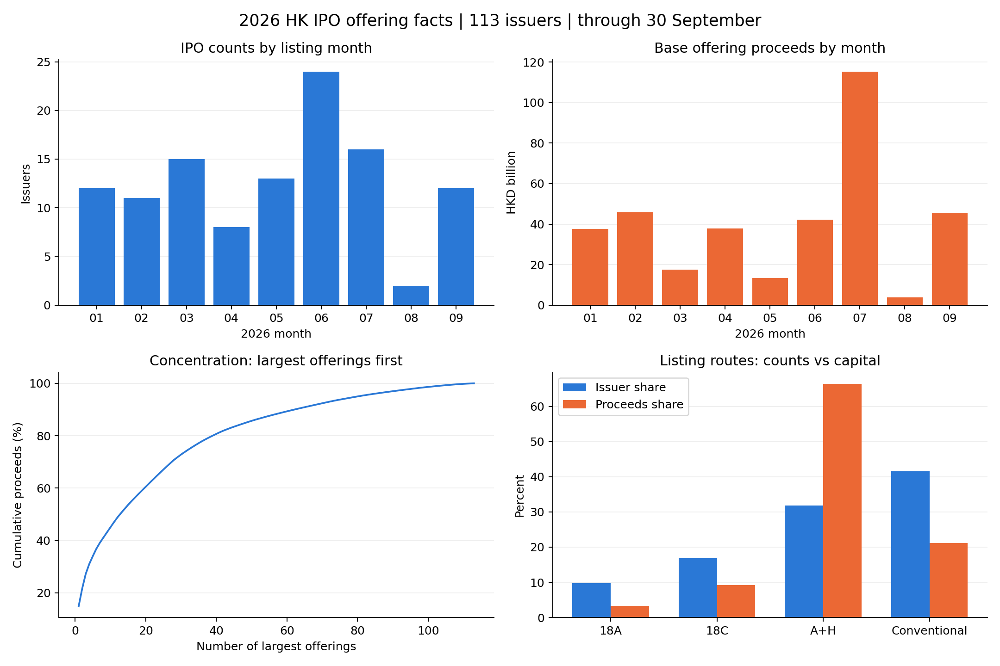

# Offering and Company Facts: 113 Hong Kong IPOs through 30 September 2026

This report examines offering terms, issuer fundamentals, investor backing, retail demand, allocation, fees and the issuance timetable. First-day and aftermarket returns, trading activity, stabilization execution and lockup-event performance are excluded. It describes existing master observations; original disclosures were not independently re-audited in this exercise.

The sample contains 113 unique issuers listed between 02 January 2026 and 30 September 2026. Q1/Q2/Q3 contain 38/45/30 issuers. Each statistic uses its own available observations; missing classifications are not coded as zero. Distributions are not winsorized.

## 1. Main descriptive findings

- Base offering proceeds total HKD 359.20 billion. The median deal raises HKD 1.23 billion, compared with a mean of HKD 3.18 billion. The largest five and ten deals account for 34.0% and 45.0% of proceeds.

- 18A biotech: 11 issuers (9.7% of the sample), 3.3% of base proceeds, and median firm age 9.3 years.

- 18C specialist tech: 19 issuers (16.8% of the sample), 9.2% of base proceeds, and median firm age 9.9 years.

- A+H (19A): 36 issuers (31.9% of the sample), 66.4% of base proceeds, and median firm age 21.5 years.

- Conventional: 47 issuers (41.6% of the sample), 21.1% of base proceeds, and median firm age 12.5 years.

- The independent A+H flag identifies 38/113 issuers; the mutually exclusive route classification identifies 36. The classifications use different definitions.

- Loss-making in latest period: 51/112 (45.5%); 1 unknown observations.

- Negative latest-period operating cash flow: 59/111 (53.2%); 2 unknown observations.

- Negative latest-period equity: 21/111 (18.9%); 2 unknown observations.

- VC/PE-backed: 87/106 (82.1%); 7 unknown observations.

- VC-backed: 80/104 (76.9%); 9 unknown observations.

- PE-backed: 68/106 (64.2%); 7 unknown observations.

- CVC-backed: 57/94 (60.6%); 19 unknown observations.

- State/government pre-IPO backing: 62/99 (62.6%); 14 unknown observations.

- Top-tier VC/PE backing (current classification): 57/84 (67.9%); 29 unknown observations.

- Fixed-price classification: 70/113 (61.9%); 0 unknown observations.

- WVR flag: 4/113 (3.5%); 0 unknown observations.

- Both losses and negative operating cash flow are recorded for 47/111 issuers. Negative operating cash flow despite non-negative profits occurs in 12/111.

- Top-five customers generate at least half of revenue for 46/99 issuers. Expensed R&D exceeds same-period revenue for 13/103. Median institutional ownership is 30.9% (N=94); median pre-IPO holding duration is 7.74 years (N=94).

- The median reported retail subscription multiple is 1,073.4x; 60/113 deals reach 1,000x. The median number of applicants is 153,878. Summed applicant counts (17,484,513) include repeat applications across IPOs, rather than unique investors.

- Positive cornerstone allocation occurs in 95/113 IPOs. The median cornerstone share is 38.6% and the median final retail share is 10.0% of base offer shares. These shares must not be added to public ownership measured against company capital.

- Median public ownership is 30.5%, compared with unrestricted public ownership of 7.5%. Unrestricted ownership is below 10% in 80/112 issuers. For paired observations using the same company-capital denominator, the median gap is 24.7 percentage points (N=109).

- Final retail shares divided by valid applied shares have a median of 0.1078%; 53/113 are below 0.1%. This issuer-level overall allocation ratio is not the probability of obtaining one board lot.

- The final retail tranche share exceeds its initial share in 21/113 deals and is smaller in 8, using a 0.01-percentage-point tolerance. These differences can reflect reallocation or changes in total offering size; they do not establish a particular legal trigger.

- Existing-share sales are recorded in 1/113 offerings. Positive planned debt-repayment allocations occur in 12/111; zeros are described as recorded values, rather than freshly verified disclosures.

- The median disclosed Hong Kong commission is 2.50% (N=112). Median listing expenses are HKD 89.9 million; the median expense/base-proceeds ratio is 6.85% (N=111). Listing expenses may include commissions, so these costs cannot be added without checking disclosure scope.

- The median subscription-close-to-listing interval is 5 calendar days (N=113). Only 59 pricing dates are available; subscription closing dates are not substituted for them.

## 2. Descriptive distributions

Percentage variables are displayed after multiplying decimal source shares by 100. Binary means are proportions among observed cases. Extreme financial ratios are retained, including cases with very small revenue denominators.

| Metric | Unit | Missing N | Valid N | Mean | SD | Min | P10 | P25 | Median | P75 | P90 | Max |
| --- | --- | --- | --- | --- | --- | --- | --- | --- | --- | --- | --- | --- |
| Firm age at listing | Years | 0 | 113 | 15.085 | 7.027 | 0.670 | 6.548 | 9.970 | 13.490 | 20.000 | 24.022 | 33.580 |
| Base offering proceeds | HKD billion | 0 | 113 | 3.179 | 5.976 | 0.200 | 0.499 | 0.717 | 1.233 | 3.677 | 6.491 | 53.410 |
| Recorded HK plus international proceeds (mixed overallotment scope) | HKD billion | 1 | 112 | 3.457 | 6.759 | 0.200 | 0.499 | 0.742 | 1.361 | 4.365 | 6.758 | 61.422 |
| Offer price | HKD | 0 | 113 | 77.829 | 115.811 | 3.480 | 11.040 | 20.810 | 43.240 | 87.920 | 164.400 | 980.000 |
| Issuer net proceeds (as disclosed) | HKD billion | 0 | 113 | 3.068 | 5.920 | 0.167 | 0.436 | 0.650 | 1.160 | 3.528 | 6.304 | 52.891 |
| Listing expenses (as disclosed) | HKD million | 2 | 111 | 112.313 | 74.674 | 14.900 | 59.600 | 69.700 | 89.900 | 133.250 | 198.800 | 532.100 |
| Listing expenses/base offering proceeds | % | 2 | 111 | 7.571 | 4.655 | 0.625 | 2.195 | 4.014 | 6.849 | 10.222 | 13.035 | 24.778 |
| Disclosed HK underwriting commission | % | 1 | 112 | 2.339 | 0.986 | 0.300 | 0.800 | 1.600 | 2.500 | 3.000 | 3.500 | 5.000 |
| Disclosed international underwriting commission | % | 1 | 112 | 2.339 | 0.986 | 0.300 | 0.800 | 1.600 | 2.500 | 3.000 | 3.500 | 5.000 |
| Sale shares/initial global offer | % | 0 | 113 | 0.885 | 9.407 | 0.000 | 0.000 | 0.000 | 0.000 | 0.000 | 0.000 | 100.000 |
| Initial retail share of initial offer | % | 0 | 113 | 9.159 | 1.878 | 5.000 | 5.000 | 10.000 | 10.000 | 10.000 | 10.000 | 10.002 |
| Final retail share of final base offer | % | 0 | 113 | 11.495 | 3.644 | 6.182 | 10.000 | 10.000 | 10.000 | 10.000 | 20.000 | 20.001 |
| Final minus initial retail share | Percentage points | 0 | 113 | 2.336 | 5.413 | -1.304 | 0.000 | 0.000 | 0.000 | 0.000 | 15.000 | 15.000 |
| Final retail shares/valid applied shares | % | 0 | 113 | 1.688 | 4.968 | 0.010 | 0.027 | 0.056 | 0.108 | 0.634 | 2.779 | 29.532 |
| Reported retail subscription multiple | Times | 0 | 113 | 1,985.186 | 2,482.093 | 3.390 | 42.388 | 174.120 | 1,073.370 | 2,730.730 | 5,443.630 | 14,855.400 |
| Public applicants | Applications | 0 | 113 | 154,730.204 | 94,449.618 | 12,645.000 | 36,312.800 | 66,692.000 | 153,878.000 | 207,986.000 | 265,230.800 | 471,116.000 |
| Nominal valid application value | HKD billion | 0 | 113 | 200.194 | 199.538 | 1.015 | 8.477 | 32.956 | 130.896 | 290.156 | 551.567 | 730.994 |
| Nominal application value per applicant | HKD thousand | 0 | 113 | 1,001.138 | 671.727 | 47.229 | 228.286 | 376.524 | 868.304 | 1,437.735 | 1,928.974 | 2,764.608 |
| Cornerstone share of base offer | % | 0 | 113 | 32.901 | 19.138 | 0.000 | 0.000 | 16.130 | 38.586 | 49.770 | 49.976 | 68.630 |
| Public ownership at listing | % | 1 | 112 | 34.583 | 23.722 | 2.980 | 6.530 | 10.125 | 30.485 | 53.578 | 67.447 | 97.270 |
| Unrestricted public ownership at listing | % | 1 | 112 | 7.780 | 4.187 | 1.740 | 2.789 | 5.285 | 7.510 | 10.000 | 10.945 | 25.000 |
| Pre-IPO institutional ownership | % | 19 | 94 | 30.988 | 25.955 | 0.000 | 0.000 | 3.650 | 30.880 | 53.493 | 65.174 | 83.860 |
| Controller economic interest | % | 2 | 111 | 36.767 | 17.075 | 2.280 | 15.870 | 26.615 | 35.160 | 46.725 | 57.760 | 77.510 |
| Controller voting interest | % | 1 | 112 | 38.366 | 17.446 | 2.280 | 17.086 | 27.435 | 35.625 | 47.965 | 67.200 | 79.630 |
| Top-five customer revenue share | % | 14 | 99 | 49.387 | 28.299 | 0.000 | 9.500 | 29.600 | 47.700 | 72.600 | 90.720 | 100.000 |
| Planned debt repayment share of net proceeds | % | 2 | 111 | 1.413 | 4.499 | 0.000 | 0.000 | 0.000 | 0.000 | 0.000 | 4.500 | 26.300 |
| Public minus unrestricted public ownership (matched denominator) | Percentage points | 4 | 109 | 26.667 | 23.034 | 0.000 | 2.378 | 3.870 | 24.680 | 44.630 | 57.080 | 93.030 |
| Voting minus economic interest | Percentage points | 2 | 111 | 1.679 | 7.932 | -5.150 | 0.000 | 0.000 | 0.000 | 0.000 | 0.000 | 46.150 |
| Pre-IPO holding duration | Years | 19 | 94 | 7.838 | 4.501 | 0.000 | 0.339 | 5.008 | 7.740 | 10.913 | 13.068 | 18.200 |
| VC/PE-backed | 0/1 | 7 | 106 | 0.821 | 0.385 | 0.000 | 0.000 | 1.000 | 1.000 | 1.000 | 1.000 | 1.000 |
| VC-backed | 0/1 | 9 | 104 | 0.769 | 0.423 | 0.000 | 0.000 | 1.000 | 1.000 | 1.000 | 1.000 | 1.000 |
| PE-backed | 0/1 | 7 | 106 | 0.642 | 0.482 | 0.000 | 0.000 | 0.000 | 1.000 | 1.000 | 1.000 | 1.000 |
| CVC-backed | 0/1 | 19 | 94 | 0.606 | 0.491 | 0.000 | 0.000 | 0.000 | 1.000 | 1.000 | 1.000 | 1.000 |
| State/government pre-IPO backing | 0/1 | 14 | 99 | 0.626 | 0.486 | 0.000 | 0.000 | 0.000 | 1.000 | 1.000 | 1.000 | 1.000 |
| Top-tier VC/PE backing (current classification) | 0/1 | 29 | 84 | 0.679 | 0.470 | 0.000 | 0.000 | 0.000 | 1.000 | 1.000 | 1.000 | 1.000 |
| Independent A+H flag | 0/1 | 0 | 113 | 0.336 | 0.475 | 0.000 | 0.000 | 0.000 | 0.000 | 1.000 | 1.000 | 1.000 |
| WVR flag | 0/1 | 0 | 113 | 0.035 | 0.186 | 0.000 | 0.000 | 0.000 | 0.000 | 0.000 | 0.000 | 1.000 |
| Loss-making in latest period | 0/1 | 1 | 112 | 0.455 | 0.500 | 0.000 | 0.000 | 0.000 | 0.000 | 1.000 | 1.000 | 1.000 |
| Negative latest-period operating cash flow | 0/1 | 2 | 111 | 0.532 | 0.501 | 0.000 | 0.000 | 0.000 | 1.000 | 1.000 | 1.000 | 1.000 |
| Negative latest-period equity | 0/1 | 2 | 111 | 0.189 | 0.393 | 0.000 | 0.000 | 0.000 | 0.000 | 0.000 | 1.000 | 1.000 |
| Liabilities/assets | % | 2 | 111 | 93.346 | 121.388 | 7.741 | 19.578 | 32.265 | 51.470 | 81.340 | 238.680 | 859.602 |
| Cash/assets | % | 2 | 111 | 20.252 | 16.930 | 0.860 | 5.254 | 8.883 | 14.870 | 26.533 | 41.770 | 80.941 |
| Interest-bearing debt/assets | % | 2 | 111 | 45.228 | 102.625 | 0.000 | 1.207 | 4.688 | 17.268 | 34.354 | 61.143 | 745.022 |
| Net profit margin (same-period originals) | % | 4 | 109 | -310.394 | 2,026.555 | -20,828.788 | -313.788 | -40.798 | 1.927 | 12.028 | 23.846 | 47.468 |
| Operating cash flow/revenue (same-period originals) | % | 5 | 108 | -212.476 | 1,594.253 | -16,450.000 | -142.267 | -21.374 | -1.021 | 10.571 | 24.005 | 64.001 |
| Expensed R&D/revenue (same-period originals) | % | 10 | 103 | 72.845 | 204.063 | -24.061 | 1.348 | 3.689 | 8.539 | 19.756 | 146.502 | 1,219.315 |
| Capitalized development additions/revenue (same-period originals) | % | 12 | 101 | 0.298 | 1.412 | 0.000 | 0.000 | 0.000 | 0.000 | 0.000 | 0.040 | 10.395 |
| Revenue growth using current annualization convention | % | 3 | 110 | 109.375 | 670.226 | -92.457 | -4.556 | 6.055 | 20.488 | 45.563 | 94.810 | 6,985.020 |
| Annualized net profit/closing assets | % | 2 | 111 | -10.114 | 32.079 | -161.431 | -55.788 | -20.837 | 0.455 | 9.280 | 16.234 | 51.770 |
| Fixed-price classification | 0/1 | 0 | 113 | 0.619 | 0.488 | 0.000 | 0.000 | 0.000 | 1.000 | 1.000 | 1.000 | 1.000 |
| Range offer-price revision versus midpoint | % | 70 | 43 | -0.877 | 7.909 | -15.000 | -11.071 | -6.076 | -0.903 | 4.588 | 7.080 | 23.077 |
| Filing range width/midpoint | % | 70 | 43 | 15.671 | 8.575 | 3.003 | 7.106 | 9.565 | 13.974 | 21.396 | 24.850 | 46.154 |
| Offer-price position in range | % | 70 | 43 | 50.153 | 44.635 | 0.000 | 0.000 | 0.000 | 42.857 | 100.000 | 100.000 | 100.000 |
| Subscription opening to close | Calendar days | 0 | 113 | 4.611 | 1.352 | 3.000 | 3.000 | 3.000 | 5.000 | 6.000 | 6.000 | 8.000 |
| Subscription close to listing | Calendar days | 0 | 113 | 4.425 | 1.067 | 3.000 | 3.000 | 3.000 | 5.000 | 5.000 | 5.800 | 6.000 |
| Prospectus to listing | Calendar days | 0 | 113 | 9.044 | 1.191 | 8.000 | 8.000 | 8.000 | 9.000 | 10.000 | 11.000 | 13.000 |
| Pricing to listing | Calendar days | 54 | 59 | 2.949 | 1.041 | 2.000 | 2.000 | 2.000 | 2.000 | 4.000 | 4.000 | 5.000 |
| Allotment announcement to listing | Calendar days | 0 | 113 | 1.372 | 0.804 | 0.000 | 1.000 | 1.000 | 1.000 | 1.000 | 3.000 | 4.000 |
| Latest financial-period length (annualization factor×12) | Months | 0 | 113 | 10.752 | 1.925 | 6.000 | 8.200 | 9.000 | 12.000 | 12.000 | 12.000 | 12.000 |
| Sponsor participants parsed from Sponsor(s) | Institutions | 1 | 112 | 1.821 | 0.762 | 1.000 | 1.000 | 1.000 | 2.000 | 2.000 | 3.000 | 4.000 |

## 3. Time, Industry and Offering Structure

### Listing quarter

Full CSV tables report valid N for each metric. The issuer count is not the denominator for every statistic. Metric keys correspond to issuer_facts.csv and the definitions below.

| Group | Issuer N | Base proceeds (HKD bn) | Proceeds share (%) | base_bn median | subscription median | corner median | loss (%) | loss N |
| --- | --- | --- | --- | --- | --- | --- | --- | --- |
| 2026Q1 | 38 | 101.030 | 28.127 | 1.630 | 1,072.045 | 41.860 | 39.474 | 38 |
| 2026Q2 | 45 | 93.416 | 26.007 | 1.100 | 2,003.160 | 37.140 | 52.273 | 44 |
| 2026Q3 | 30 | 164.749 | 45.866 | 2.325 | 239.660 | 38.325 | 43.333 | 30 |

### Listing month

Full CSV tables report valid N for each metric. The issuer count is not the denominator for every statistic. Metric keys correspond to issuer_facts.csv and the definitions below.

| Group | Issuer N | Base proceeds (HKD bn) | Proceeds share (%) | base_bn median | subscription median | corner median | loss (%) | loss N |
| --- | --- | --- | --- | --- | --- | --- | --- | --- |
| 2026-01 | 12 | 37.620 | 10.473 | 3.674 | 1,120.850 | 44.150 | 50.000 | 12 |
| 2026-02 | 11 | 45.871 | 12.771 | 2.959 | 569.580 | 43.480 | 18.182 | 11 |
| 2026-03 | 15 | 17.539 | 4.883 | 1.026 | 1,073.370 | 15.330 | 46.667 | 15 |
| 2026-04 | 8 | 37.784 | 10.519 | 2.566 | 1,120.130 | 44.315 | 37.500 | 8 |
| 2026-05 | 13 | 13.357 | 3.719 | 0.872 | 5,480.230 | 34.710 | 61.538 | 13 |
| 2026-06 | 24 | 42.275 | 11.769 | 1.090 | 1,492.350 | 40.398 | 52.174 | 23 |
| 2026-07 | 16 | 115.352 | 32.114 | 1.761 | 335.875 | 45.275 | 31.250 | 16 |
| 2026-08 | 2 | 3.729 | 1.038 | 1.864 | 1,720.455 | 24.025 | 50.000 | 2 |
| 2026-09 | 12 | 45.668 | 12.714 | 2.675 | 84.055 | 27.620 | 58.333 | 12 |

### Industry

Full CSV tables report valid N for each metric. The issuer count is not the denominator for every statistic. Metric keys correspond to issuer_facts.csv and the definitions below.

| Group | Issuer N | Base proceeds (HKD bn) | Proceeds share (%) | base_bn median | subscription median | corner median | loss (%) | loss N |
| --- | --- | --- | --- | --- | --- | --- | --- | --- |
| Biotech and pharma | 10 | 11.983 | 3.336 | 1.198 | 1,594.530 | 42.505 | 90.000 | 10 |
| Consumer discretionary | 8 | 21.486 | 5.982 | 0.624 | 366.905 | 11.040 | 37.500 | 8 |
| Consumer staples | 6 | 26.427 | 7.357 | 2.452 | 1,793.795 | 45.310 | 0.000 | 6 |
| Hardware and robotics | 17 | 103.250 | 28.745 | 1.380 | 1,149.760 | 39.470 | 47.059 | 17 |
| Industrials and equipment | 24 | 92.716 | 25.812 | 3.029 | 788.400 | 42.160 | 20.833 | 24 |
| Materials and mining | 6 | 9.375 | 2.610 | 1.164 | 185.520 | 32.510 | 20.000 | 5 |
| Medical devices and services | 8 | 5.811 | 1.618 | 0.696 | 1,082.655 | 33.150 | 50.000 | 8 |
| Other | 2 | 0.805 | 0.224 | 0.403 | 1,275.650 | 5.750 | 50.000 | 2 |
| Semiconductors | 18 | 61.758 | 17.193 | 3.044 | 624.760 | 47.425 | 50.000 | 18 |
| Software and AI | 14 | 25.583 | 7.122 | 0.886 | 1,976.190 | 28.465 | 78.571 | 14 |

### Exclusive listing route

Full CSV tables report valid N for each metric. The issuer count is not the denominator for every statistic. Metric keys correspond to issuer_facts.csv and the definitions below.

| Group | Issuer N | Base proceeds (HKD bn) | Proceeds share (%) | base_bn median | subscription median | corner median | loss (%) | loss N |
| --- | --- | --- | --- | --- | --- | --- | --- | --- |
| 18A biotech | 11 | 11.905 | 3.314 | 1.112 | 1,181.460 | 42.500 | 100.000 | 11 |
| 18C specialist tech | 19 | 32.931 | 9.168 | 1.067 | 4,571.990 | 37.520 | 100.000 | 19 |
| A+H (19A) | 36 | 238.430 | 66.379 | 4.658 | 289.610 | 44.210 | 5.556 | 36 |
| Conventional | 47 | 75.931 | 21.139 | 0.830 | 1,590.560 | 31.400 | 41.304 | 46 |

### Base offering size

Full CSV tables report valid N for each metric. The issuer count is not the denominator for every statistic. Metric keys correspond to issuer_facts.csv and the definitions below.

| Group | Issuer N | Base proceeds (HKD bn) | Proceeds share (%) | base_bn median | subscription median | corner median | loss (%) | loss N |
| --- | --- | --- | --- | --- | --- | --- | --- | --- |
| Below HKD1bn | 40 | 24.188 | 6.734 | 0.611 | 2,411.395 | 5.295 | 56.410 | 39 |
| HKD1–5bn | 56 | 132.206 | 36.806 | 1.694 | 1,038.970 | 45.210 | 44.643 | 56 |
| HKD5–10bn | 11 | 70.587 | 19.651 | 6.641 | 134.390 | 47.690 | 27.273 | 11 |
| HKD10bn or more | 6 | 132.214 | 36.808 | 16.857 | 11.360 | 48.825 | 16.667 | 6 |

### VC/PE backing

Full CSV tables report valid N for each metric. The issuer count is not the denominator for every statistic. Metric keys correspond to issuer_facts.csv and the definitions below.

| Group | Issuer N | Base proceeds (HKD bn) | Proceeds share (%) | base_bn median | subscription median | corner median | loss (%) | loss N |
| --- | --- | --- | --- | --- | --- | --- | --- | --- |
| Not VC/PE-backed | 19 | 114.777 | 31.954 | 3.245 | 251.730 | 42.210 | 10.526 | 19 |
| Unknown | 7 | 50.553 | 14.074 | 5.097 | 27.570 | 47.690 | 14.286 | 7 |
| VC/PE-backed | 87 | 193.865 | 53.972 | 1.112 | 1,421.540 | 37.140 | 55.814 | 86 |

### Pricing position

Full CSV tables report valid N for each metric. The issuer count is not the denominator for every statistic. Metric keys correspond to issuer_facts.csv and the definitions below.

| Group | Issuer N | Base proceeds (HKD bn) | Proceeds share (%) | base_bn median | subscription median | corner median | loss (%) | loss N |
| --- | --- | --- | --- | --- | --- | --- | --- | --- |
| At high | 17 | 45.109 | 12.558 | 2.353 | 1,837.170 | 42.310 | 47.059 | 17 |
| At low | 13 | 9.085 | 2.529 | 0.600 | 664.920 | 3.630 | 58.333 | 12 |
| Fixed price | 70 | 282.761 | 78.721 | 1.630 | 817.335 | 43.410 | 40.000 | 70 |
| Within range | 13 | 22.240 | 6.192 | 0.758 | 1,790.400 | 22.100 | 61.538 | 13 |

### Recorded mechanism

Full CSV tables report valid N for each metric. The issuer count is not the denominator for every statistic. Metric keys correspond to issuer_facts.csv and the definitions below.

| Group | Issuer N | Base proceeds (HKD bn) | Proceeds share (%) | base_bn median | subscription median | corner median | loss (%) | loss N |
| --- | --- | --- | --- | --- | --- | --- | --- | --- |
| Mechanism A | 25 | 40.447 | 11.260 | 1.067 | 3,646.060 | 37.520 | 91.667 | 24 |
| Mechanism B | 85 | 316.595 | 88.140 | 1.380 | 531.330 | 38.830 | 31.765 | 85 |
| nan | 3 | 2.154 | 0.600 | 0.647 | 1,181.460 | 0.000 | 66.667 | 3 |

### Cornerstone allocation

Full CSV tables report valid N for each metric. The issuer count is not the denominator for every statistic. Metric keys correspond to issuer_facts.csv and the definitions below.

| Group | Issuer N | Base proceeds (HKD bn) | Proceeds share (%) | base_bn median | subscription median | corner median | loss (%) | loss N |
| --- | --- | --- | --- | --- | --- | --- | --- | --- |
| No cornerstones | 18 | 9.964 | 2.774 | 0.600 | 2,134.235 | 0.000 | 52.941 | 17 |
| Cornerstone below25% | 13 | 27.349 | 7.614 | 0.682 | 140.020 | 12.320 | 61.538 | 13 |
| Cornerstone25–50% | 72 | 231.718 | 64.510 | 1.600 | 555.900 | 42.765 | 38.889 | 72 |
| Cornerstone50% or more | 10 | 90.164 | 25.102 | 3.476 | 2,092.350 | 53.400 | 60.000 | 10 |

### Industry by quarter

| sector | 2026Q1 | 2026Q2 | 2026Q3 |
| --- | --- | --- | --- |
| Biotech and pharma | 1 | 9 | 0 |
| Consumer discretionary | 3 | 2 | 3 |
| Consumer staples | 3 | 2 | 1 |
| Hardware and robotics | 5 | 6 | 6 |
| Industrials and equipment | 6 | 10 | 8 |
| Materials and mining | 2 | 2 | 2 |
| Medical devices and services | 3 | 3 | 2 |
| Other | 1 | 1 | 0 |
| Semiconductors | 9 | 5 | 4 |
| Software and AI | 5 | 5 | 4 |

### Route by recorded mechanism

| route | Mechanism A | Mechanism B | Unknown |
| --- | --- | --- | --- |
| 18A biotech | 1 | 8 | 2 |
| 18C specialist tech | 19 | 0 | 0 |
| A+H (19A) | 1 | 35 | 0 |
| Conventional | 4 | 42 | 1 |

### Backing by route

| backing_group | 18A biotech | 18C specialist tech | A+H (19A) | Conventional |
| --- | --- | --- | --- | --- |
| Not VC/PE-backed | 0 | 0 | 14 | 5 |
| Unknown | 0 | 0 | 7 | 0 |
| VC/PE-backed | 11 | 19 | 15 | 42 |

### Losses and negative operating cash flow

| loss | 0.0 | 1.0 | Unknown |
| --- | --- | --- | --- |
| 0.0 | 48 | 12 | 1 |
| 1.0 | 4 | 47 | 0 |
| Unknown | 0 | 0 | 1 |

## 4. Proceeds Concentration

| Stock Code | Company Name at time of listing | cohort | route | sector | base_bn | Cumulative proceeds share (%) |
| --- | --- | --- | --- | --- | --- | --- |
| 3308.HK | ZHONGJI INNOLIGHT CO., LTD. - H Shares | 2026Q3 | A+H (19A) | Hardware and robotics | 53.410 | 14.869 |
| 2475.HK | Luxshare Precision Industry Co., Ltd. - H Shares | 2026Q3 | A+H (19A) | Hardware and robotics | 24.266 | 21.625 |
| 2476.HK | Victory Giant Technology (HuiZhou) Co., Ltd. - H Shares | 2026Q2 | A+H (19A) | Industrials and equipment | 20.117 | 27.226 |
| 0625.HK | SHEIN Global Holdings Limited - W | 2026Q3 | Conventional | Consumer discretionary | 13.596 | 31.011 |
| 2714.HK | Muyuan Foods Co., Ltd. - H shares | 2026Q1 | A+H (19A) | Consumer staples | 10.684 | 33.985 |
| 9980.HK | Eastroc Beverage (Group) Co., Ltd. - H shares | 2026Q1 | A+H (19A) | Consumer staples | 10.141 | 36.808 |
| 1688.HK | LINGYI iTECH (GUANGDONG) COMPANY - H Shares | 2026Q2 | A+H (19A) | Industrials and equipment | 8.264 | 39.109 |
| 6951.HK | Chaozhou Three-Circle (Group) Co., Ltd. - H Shares | 2026Q3 | A+H (19A) | Industrials and equipment | 7.158 | 41.102 |
| 9976.HK | Shenzhen Longsys Electronics Co., Ltd. - H Shares | 2026Q3 | A+H (19A) | Semiconductors | 7.078 | 43.072 |
| 6809.HK | Montage Technology Co., Ltd. - H shares | 2026Q1 | A+H (19A) | Semiconductors | 7.043 | 45.033 |
| 2249.HK | NEXCHIP SEMICONDUCTOR (CHINA) LIMITED - H Shares | 2026Q3 | A+H (19A) | Semiconductors | 6.982 | 46.977 |
| 1081.HK | Dajin Heavy Industry Co., Ltd. - H Shares | 2026Q2 | A+H (19A) | Industrials and equipment | 6.641 | 48.826 |
| 6880.HK | MOMENTA GLOBAL LIMITED - W | 2026Q3 | Conventional | Software and AI | 5.894 | 50.467 |
| 9856.HK | Ligent Technologies, Inc. | 2026Q3 | Conventional | Hardware and robotics | 5.670 | 52.045 |
| 6082.HK | Shanghai Biren Technology Co., Ltd.- H shares | 2026Q1 | 18C specialist tech | Semiconductors | 5.583 | 53.599 |

## 5. Financial Statements and Reporting Currency

Profit, cash-flow and R&D ratios use same-currency, same-period original amounts. Revenue growth and ROA use the existing annualization convention; annualization does not remove seasonality. ROA uses closing assets. Absolute statement amounts are summarized separately by reporting currency and are not multiplied by the unit multiplier again.

| Currency | Field | Valid N | Median | P25 | P75 |
| --- | --- | --- | --- | --- | --- |
| HKD | total assets in year-1 | 1 | 1,336.986 | 1,336.986 | 1,336.986 |
| HKD | total equity in year-1 | 1 | 55.431 | 55.431 | 55.431 |
| HKD | Year-1 net sales (original, pre-annualization) | 1 | 3,052.702 | 3,052.702 | 3,052.702 |
| HKD | Year-1 profit for period (original) | 1 | 222.575 | 222.575 | 222.575 |
| HKD | Operating cash flow in year-1 (before annualization) | 1 | 1,081.612 | 1,081.612 | 1,081.612 |
| HKD | Cash and cash equivalents at year-1 end | 1 | 49.896 | 49.896 | 49.896 |
| HKD | R&D expensed in year-1 (before annualization) | 0 | — | — | — |
| HKD | Capital expenditure in year-1 | 1 | 28.716 | 28.716 | 28.716 |
| RMB | total assets in year-1 | 107 | 1,990.073 | 722.968 | 8,833.325 |
| RMB | total equity in year-1 | 107 | 857.810 | 151.423 | 4,023.338 |
| RMB | Year-1 net sales (original, pre-annualization) | 108 | 843.564 | 372.583 | 4,080.843 |
| RMB | Year-1 profit for period (original) | 108 | 29.527 | -167.350 | 515.593 |
| RMB | Operating cash flow in year-1 (before annualization) | 107 | -19.078 | -127.566 | 183.776 |
| RMB | Cash and cash equivalents at year-1 end | 107 | 321.227 | 114.179 | 1,388.836 |
| RMB | R&D expensed in year-1 (before annualization) | 104 | 122.697 | 51.523 | 337.409 |
| RMB | Capital expenditure in year-1 | 107 | 43.400 | 12.768 | 174.850 |
| USD | total assets in year-1 | 3 | 1,133.092 | 936.865 | 10,871.046 |
| USD | total equity in year-1 | 3 | -1,303.499 | -4,130.749 | -461.280 |
| USD | Year-1 net sales (original, pre-annualization) | 3 | 53.437 | 26.784 | 18,130.718 |
| USD | Year-1 profit for period (original) | 3 | -396.000 | -454.007 | -211.747 |
| USD | Operating cash flow in year-1 (before annualization) | 3 | -21.714 | -115.555 | 185.143 |
| USD | Cash and cash equivalents at year-1 end | 3 | 362.647 | 203.977 | 2,337.823 |
| USD | R&D expensed in year-1 (before annualization) | 2 | 199.156 | 189.734 | 208.578 |
| USD | Capital expenditure in year-1 | 3 | 60.000 | 30.239 | 106.061 |

### Three-period sign patterns

Complete observations only. Non-negative includes zero and does not establish financial sustainability.

| Measure | Year-3 to year-1 | N | Three-period complete N | Incomplete N |
| --- | --- | --- | --- | --- |
| Profit | Non-negative → Non-negative → Non-negative | 54 | 105 | 8 |
| Profit | Negative → Negative → Negative | 38 | 105 | 8 |
| Profit | Negative → Non-negative → Non-negative | 5 | 105 | 8 |
| Profit | Non-negative → Non-negative → Negative | 4 | 105 | 8 |
| Profit | Negative → Non-negative → Negative | 2 | 105 | 8 |
| Profit | Non-negative → Negative → Non-negative | 1 | 105 | 8 |
| Profit | Negative → Negative → Non-negative | 1 | 105 | 8 |
| Equity | Non-negative → Non-negative → Non-negative | 79 | 104 | 9 |
| Equity | Negative → Negative → Negative | 19 | 104 | 9 |
| Equity | Non-negative → Negative → Non-negative | 2 | 104 | 9 |
| Equity | Negative → Non-negative → Non-negative | 2 | 104 | 9 |
| Equity | Negative → Negative → Non-negative | 2 | 104 | 9 |

### Illustrative threshold counts

Thresholds are descriptive and are not treated as regulatory cutoffs or prespecified hypotheses.

| Metric | Unit | Below threshold | Count | Valid N | Share (%) | Missing N |
| --- | --- | --- | --- | --- | --- | --- |
| Firm age at listing | Years | 10.000 | 29 | 113 | 25.664 | 0 |
| Firm age at listing | Years | 20.000 | 84 | 113 | 74.336 | 0 |
| Unrestricted public ownership at listing | % | 5.000 | 25 | 112 | 22.321 | 1 |
| Unrestricted public ownership at listing | % | 10.000 | 80 | 112 | 71.429 | 1 |
| Final retail shares/valid applied shares | % | 0.100 | 53 | 113 | 46.903 | 0 |
| Final retail shares/valid applied shares | % | 1.000 | 92 | 113 | 81.416 | 0 |
| Pre-IPO holding duration | Years | 5.000 | 24 | 94 | 25.532 | 19 |
| Top-five customer revenue share | % | 50.000 | 53 | 99 | 53.535 | 14 |
| Listing expenses/base offering proceeds | % | 10.000 | 82 | 111 | 73.874 | 2 |
| Controller economic interest | % | 50.000 | 90 | 111 | 81.081 | 2 |

## 6. Intermediary Participation and Source Categories

Sponsor(s) is split on slashes, whitespace is normalized, and duplicates within a deal are removed. Each co-sponsored deal counts once for each participant: counts and associated proceeds cannot be summed across firms. No lead role or merger-related name consolidation is inferred. Source-language controller and address categories are preserved verbatim in categorical_frequencies.csv.

| Institution | deals | associated_base_proceeds_hkd_bn |
| --- | --- | --- |
| China International Capital Corporation Hong Kong Securities Limited | 33 | 165.231 |
| CITIC Securities (Hong Kong) Limited | 29 | 93.846 |
| Huatai Financial Holdings (Hong Kong) Limited | 16 | 48.283 |
| Guotai Junan Capital Limited | 11 | 24.127 |
| Haitong International Capital Limited | 9 | 13.195 |
| China Securities (International) Corporate Finance Company Limited | 8 | 30.376 |
| Morgan Stanley Asia Limited | 7 | 96.673 |
| CCB International Capital Limited | 7 | 6.953 |
| China Merchants Securities (HK) Co., Limited | 7 | 15.566 |
| Goldman Sachs (Asia) L.L.C. | 6 | 107.432 |
| Deutsche Securities Asia Limited | 5 | 12.552 |
| UBS Securities Hong Kong Limited | 5 | 29.186 |
| J.P. Morgan Securities (Far East) Limited | 5 | 44.500 |
| ABCI Capital Limited | 5 | 3.374 |
| BOCI Asia Limited | 5 | 8.328 |

### Reporting Accountants

| Category | N |
| --- | --- |
| Ernst & Young | 51 |
| KPMG | 17 |
| Deloitte Touche Tohmatsu | 16 |
| PricewaterhouseCoopers | 8 |
| BDO Limited | 7 |
| Rongcheng (Hong Kong) CPA Limited | 4 |
| SHINEWING (HK) CPA Limited | 3 |
| Confucius International CPA Limited | 2 |
| KPMG Huazhen LLP | 1 |
| Moore CPA Limited | 1 |
| RSM Hong Kong | 1 |
| Grant Thornton Hong Kong Limited | 1 |
| <NA> | 1 |

### Place of incorporation

| Category | N |
| --- | --- |
| PRC | 71 |
| <NA> | 36 |
| Cayman Islands | 6 |

### currency in financial information

| Category | N |
| --- | --- |
| RMB | 109 |
| USD | 3 |
| HKD | 1 |

### Share class

| Category | N |
| --- | --- |
| H Shares | 98 |
| Ordinary Shares | 4 |
| H Shares (ordinary shares) | 3 |
| Class A Ordinary Shares | 2 |
| Ordinary shares | 2 |
| H Shares (Class B Ordinary Shares) | 1 |
| Ordinary Shares (H Shares and Unlisted Shares) | 1 |
| Class B Shares | 1 |
| Ordinary Shares (par value US$0.02 each) | 1 |

## 7. Pairwise Associations

Pairwise Spearman correlations and valid N are reported without significance screening. Some correlations have mechanical denominator links, especially subscription versus allocation and size versus expense/proceeds.

| Variable A | Variable B | N | Spearman |
| --- | --- | --- | --- |
| Reported retail subscription multiple | Final retail shares/valid applied shares | 113 | -0.931 |
| Base offering proceeds | Listing expenses/base offering proceeds | 111 | -0.930 |
| Disclosed HK underwriting commission | Listing expenses/base offering proceeds | 110 | 0.813 |
| Reported retail subscription multiple | Public applicants | 113 | 0.800 |
| Base offering proceeds | Unrestricted public ownership at listing | 112 | -0.771 |
| Unrestricted public ownership at listing | Listing expenses/base offering proceeds | 110 | 0.744 |
| Public applicants | Final retail shares/valid applied shares | 113 | -0.742 |
| Base offering proceeds | Cornerstone share of base offer | 113 | 0.732 |
| Cornerstone share of base offer | Listing expenses/base offering proceeds | 111 | -0.695 |
| Base offering proceeds | Disclosed HK underwriting commission | 112 | -0.694 |
| Unrestricted public ownership at listing | Disclosed HK underwriting commission | 111 | 0.615 |
| Cornerstone share of base offer | Unrestricted public ownership at listing | 112 | -0.588 |

## 8. Coverage and Interpretation

All 202 registered source fields are inventoried. Internal consistency checks identify 1 flagged observations. Neither the workbook nor the master is changed.

| Issue | Stock Code | Note |
| --- | --- | --- |
| Missing segment proceeds | 6802.HK | Price × final base shares remains available; recorded HK/international proceeds cover fewer than 113 issuers |

| Field | Treatment | Valid N |
| --- | --- | --- |
| Lead sponsor name | Known field error; parse participation from Sponsor(s) | 106 |
| Joint sponsor count | Parse Sponsor(s); original derived count needs review | 106 |
| Sponsor commercial bank affiliate flag | Derived institution classification requires review | 106 |
| Underwriting base commission rate (%) | Use original disclosed HK/international commission fields | 106 |
| Underwriting discretionary incentive fee rate (%) | Highly concentrated and incomplete; not actual payments | 68 |
| Total underwriting fee rate (%) | Known derived-definition problem; not total fees | 68 |
| Pre-IPO investor board seat (1=yes; 0=no) | Fourteen Q2 zeros lack supporting evidence | 95 |
| Cornerstone investor count | Partial coverage; value 4 repeated 26 times; review required | 69 |
| Pre-IPO institutional investor count | Value 6 repeated in 71 of 106 rows; review required | 106 |
| Cornerstone state-owned presence flag | Derived classification not independently source-reviewed | 106 |
| Crossover fund presence flag | Derived classification not independently source-reviewed | 106 |
| Pre-IPO state-owned backing flag | Use original State/Gov backing; review derived field | 106 |

Recorded HK plus international proceeds may include overallotment or different deal-size updates, so base proceeds are calculated consistently as price × final shares before overallotment. Net proceeds, listing expenses and base proceeds can refer to different disclosed scopes: gross-minus-net is not automatically total issuance costs. Nominal application amounts are requested shares × offer price, not actual net frozen funds. Mechanism labels are descriptive; no inference about legal eligibility is made. Coverage is not proof of independently verified evidence.

## 9. Definitions and Replication

| Key | Metric | Unit |
| --- | --- | --- |
| age | Firm age at listing | Years |
| base_bn | Base offering proceeds | HKD billion |
| reported_bn | Recorded HK plus international proceeds (mixed overallotment scope) | HKD billion |
| offer_price | Offer price | HKD |
| net_bn | Issuer net proceeds (as disclosed) | HKD billion |
| expense_m | Listing expenses (as disclosed) | HKD million |
| expense_share | Listing expenses/base offering proceeds | % |
| fee_hk | Disclosed HK underwriting commission | % |
| fee_int | Disclosed international underwriting commission | % |
| sale_share | Sale shares/initial global offer | % |
| initial_public | Initial retail share of initial offer | % |
| final_public | Final retail share of final base offer | % |
| public_increase | Final minus initial retail share | Percentage points |
| allocation | Final retail shares/valid applied shares | % |
| subscription | Reported retail subscription multiple | Times |
| applicants | Public applicants | Applications |
| applied_bn | Nominal valid application value | HKD billion |
| application_k | Nominal application value per applicant | HKD thousand |
| corner | Cornerstone share of base offer | % |
| public_float | Public ownership at listing | % |
| free_float | Unrestricted public ownership at listing | % |
| institutional | Pre-IPO institutional ownership | % |
| controller_econ | Controller economic interest | % |
| controller_vote | Controller voting interest | % |
| customers | Top-five customer revenue share | % |
| repayment | Planned debt repayment share of net proceeds | % |
| locked_gap | Public minus unrestricted public ownership (matched denominator) | Percentage points |
| voting_wedge | Voting minus economic interest | Percentage points |
| holding | Pre-IPO holding duration | Years |
| vcpe | VC/PE-backed | 0/1 |
| vc | VC-backed | 0/1 |
| pe | PE-backed | 0/1 |
| cvc | CVC-backed | 0/1 |
| state | State/government pre-IPO backing | 0/1 |
| top_vc | Top-tier VC/PE backing (current classification) | 0/1 |
| ah | Independent A+H flag | 0/1 |
| wvr | WVR flag | 0/1 |
| loss | Loss-making in latest period | 0/1 |
| negative_ocf | Negative latest-period operating cash flow | 0/1 |
| negative_equity | Negative latest-period equity | 0/1 |
| leverage | Liabilities/assets | % |
| cash_assets | Cash/assets | % |
| debt_assets | Interest-bearing debt/assets | % |
| net_margin | Net profit margin (same-period originals) | % |
| ocf_margin | Operating cash flow/revenue (same-period originals) | % |
| rd_sales | Expensed R&D/revenue (same-period originals) | % |
| capdev_sales | Capitalized development additions/revenue (same-period originals) | % |
| sales_growth | Revenue growth using current annualization convention | % |
| roa | Annualized net profit/closing assets | % |
| fixed | Fixed-price classification | 0/1 |
| revision | Range offer-price revision versus midpoint | % |
| range_width | Filing range width/midpoint | % |
| range_position | Offer-price position in range | % |
| offer_days | Subscription opening to close | Calendar days |
| close_listing | Subscription close to listing | Calendar days |
| prospectus_listing | Prospectus to listing | Calendar days |
| pricing_listing | Pricing to listing | Calendar days |
| allot_listing | Allotment announcement to listing | Calendar days |
| fiscal_months | Latest financial-period length (annualization factor×12) | Months |
| sponsor_n | Sponsor participants parsed from Sponsor(s) | Institutions |

Run `python3 analysis/offer_facts_2026.py` or `make offer-facts`. Output includes descriptive_statistics.csv, issuer_facts.csv, group_*.csv, field_inventory.csv, source_numeric_profiles.csv, financial_by_currency.csv, financial_history_patterns.csv, threshold_facts.csv, top10_facts.csv, sponsor_participation.csv, categorical_frequencies.csv, proceeds_ranking.csv, spearman_pairs.csv and consistency_flags.csv. Source profiles retain stored units; currency amounts are separated. run_manifest.json records input hashes and sample scope.

