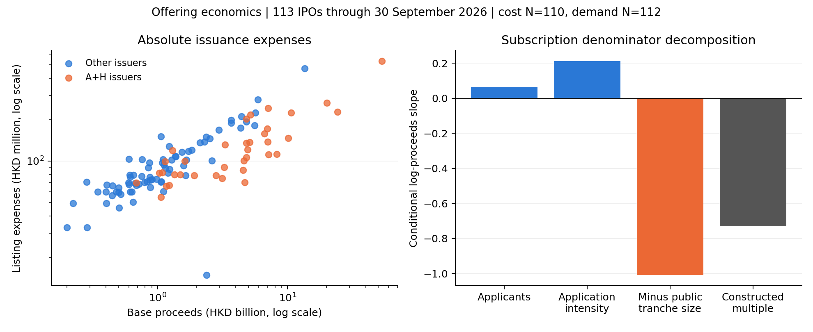

# Offering Economics: Costs, Cornerstones and Retail Demand

## Research question and sample

This report develops the offering-facts analysis into conditional models of issuance costs, disclosed commissions, cornerstone allocation and retail participation. It uses 113 unique Hong Kong Main Board IPOs listed through 30 September 2026; first-day and aftermarket performance are excluded. The data are existing export observations, without a new source audit.

These are literature-informed exploratory associations. The [design record](../../../docs/OFFERING_ECONOMICS_DESIGN_2026.md) was written before these new models were run, after existing facts had been examined. The [literature review](../../../docs/IPO_LITERATURE_METHODS_2026.md) documents inspected papers and limits to transferring their methods.

## Main results

1. **Expense scaling.** The fully adjusted log-expense elasticity is 0.452 (HC3 SE 0.036, N=110). Doubling proceeds is associated with 36.8% higher absolute expenses and -31.6% change in the expense/proceeds ratio. The null tested is elasticity=1: restricted wild p=0.0039, family-adjusted wild Holm p=0.0195.

2. **Disclosed commissions.** Doubling base proceeds is associated with a -0.342-percentage-point change in the disclosed Hong Kong tranche rate (N=111; wild p=0.0156; wild Holm p=0.0469). This is not a causal fee reduction or a full gross-spread estimate.

3. **Cornerstone composition.** In the linear model, doubling proceeds is associated with 9.47 percentage points in cornerstone share (N=112; wild p=0.0078; wild Holm p=0.0312). The fractional-logit finite contrast is reported separately below. Offer size and allocation are selected together, so this does not identify certification or the effect of mechanically enlarging a deal.

4. **Retail participation.** The applicant-count size elasticity is 0.066 (N=112; wild Holm p=0.4297). Adding final cornerstone share gives a slope of 0.839 per 100 percentage points, or 8.8% in applicants per additional 10 percentage points (wild Holm p=0.0703). This is an association with final allocation, not a causal demand effect.

## Focal inference and multiplicity

| Focal test | N | Months G | Coefficient | HC3 SE | HC3 lower | HC3 upper | Null | HC3 p | CR1 p | Restricted wild p | R squared | HC3 Holm p | Wild Holm p |
| --- | --- | --- | --- | --- | --- | --- | --- | --- | --- | --- | --- | --- | --- |
| Expense elasticity = 1 | 110 | 9 | 0.452 | 0.036 | 0.382 | 0.523 | 1.000 | <0.001 | <0.001 | 0.0039 | 0.698 | <0.001 | 0.0195 |
| Commission size slope = 0 | 111 | 9 | -0.494 | 0.081 | -0.652 | -0.335 | 0.000 | <0.001 | <0.001 | 0.0156 | 0.629 | <0.001 | 0.0469 |
| Cornerstone size slope = 0 (OLS) | 112 | 9 | 0.137 | 0.021 | 0.096 | 0.177 | 0.000 | <0.001 | <0.001 | 0.0078 | 0.499 | <0.001 | 0.0312 |
| Applicant size slope = 0 (M3) | 112 | 9 | 0.066 | 0.088 | -0.106 | 0.238 | 0.000 | 0.4536 | 0.4009 | 0.4297 | 0.296 | 0.4536 | 0.4297 |
| Applicant cornerstone slope = 0 (M4) | 112 | 9 | 0.839 | 0.427 | 0.002 | 1.676 | 0.000 | 0.0495 | 0.0501 | 0.0352 | 0.315 | 0.0990 | 0.0703 |

HC3 treats IPO residuals as independent; listing-month CR1 and restricted wild-bootstrap tests allow within-month dependence. There are nine calendar clusters. All 512 Rademacher sign patterns are enumerated, removing Monte Carlo noise but not finite-cluster approximation error. Separate Holm corrections cover five adjusted OLS focal tests; supplementary models, decomposition tests and the earlier exploration are outside this narrow family. No stars are used.

## Specifications

M1 contains log proceeds; M2 adds log age, A+H and loss status; M3 adds technology and health indicators plus Q2/Q3 indicators. Applicants M4 adds final cornerstone share. Each family fixes its common sample using the largest specification. Coefficient files include HC3 standard errors and p-values; separate model diagnostics report rank, leverage, VIF and residual degrees of freedom.

### Expenses

| Term | M1 | M2 | M3 |
| --- | --- | --- | --- |
| A+H issuer | — | -0.217 | -0.229 |
| Intercept | 4.386 | 4.434 | 4.451 |
| Health industry | — | — | 0.156 |
| Log firm age | — | -0.020 | -0.037 |
| Log base proceeds | 0.390 | 0.454 | 0.452 |
| Loss-making | — | 0.096 | 0.050 |
| Q2 listing | — | — | -0.074 |
| Q3 listing | — | — | 0.108 |
| Technology industry | — | — | 0.062 |

### Commission

| Term | M1 | M2 | M3 |
| --- | --- | --- | --- |
| A+H issuer | — | -0.367 | -0.407 |
| Intercept | 2.621 | 2.783 | 2.817 |
| Health industry | — | — | 0.169 |
| Log firm age | — | -0.105 | -0.113 |
| Log base proceeds | -0.642 | -0.506 | -0.494 |
| Loss-making | — | 0.364 | 0.349 |
| Q2 listing | — | — | -0.072 |
| Q3 listing | — | — | 0.158 |
| Technology industry | — | — | -0.094 |

### Cornerstone

| Term | M1 | M2 | M3 |
| --- | --- | --- | --- |
| A+H issuer | — | -0.034 | -0.028 |
| Intercept | 0.275 | 0.387 | 0.366 |
| Health industry | — | — | 0.087 |
| Log firm age | — | -0.039 | -0.034 |
| Log base proceeds | 0.116 | 0.128 | 0.137 |
| Loss-making | — | -0.011 | -0.021 |
| Q2 listing | — | — | 0.006 |
| Q3 listing | — | — | -0.062 |
| Technology industry | — | — | 0.012 |

### Applicants

| Term | M1 | M2 | M3 | M4 |
| --- | --- | --- | --- | --- |
| A+H issuer | — | -0.583 | -0.436 | -0.412 |
| Intercept | 11.744 | 12.225 | 11.860 | 11.553 |
| Final cornerstone share | — | — | — | 0.839 |
| Health industry | — | — | 0.055 | -0.018 |
| Log firm age | — | -0.119 | -0.082 | -0.054 |
| Log base proceeds | -0.092 | 0.058 | 0.066 | -0.049 |
| Loss-making | — | -0.108 | -0.142 | -0.124 |
| Q2 listing | — | — | 0.513 | 0.508 |
| Q3 listing | — | — | -0.343 | -0.291 |
| Technology industry | — | — | 0.256 | 0.245 |

## Bounded cornerstone-share model

The fractional-logit specification follows the conditional-mean approach of [Papke and Wooldridge](https://www.nber.org/papers/t0147). Zeros are retained and fitted shares lie in [0,1]; binomial quasi-likelihood is used with HC0 sandwich covariance. A finite doubling-size contrast averages fitted share changes over the original model sample. Percentile intervals refit on resampled listing-month blocks. Nine clusters make these intervals exploratory; the linear restricted bootstrap is not applied to nonlinear models.

| N | Months G | Doubling-size share contrast (pp) | Month-pairs lower | Month-pairs upper | Valid draws | Rejected attempts |
| --- | --- | --- | --- | --- | --- | --- |
| 112 | 9 | 9.713 | 7.207 | 13.323 | 1000 | 85 |

Bootstrap: 1000 valid draws from 1085 attempts; 85 rejected attempts. Diagnostics and draws are saved. These conditional draws omit rank-deficient resamples, and their interval is not a finite-sample-valid confidence statement.

## Retail-demand denominator decomposition

| Component | N | Coefficient | HC3 SE |
| --- | --- | --- | --- |
| ln_multiple | 112 | -0.730 | 0.187 |
| ln_applicants | 112 | 0.066 | 0.088 |
| ln_avg_application | 112 | 0.212 | 0.103 |
| ln_initial_public_value | 112 | 1.008 | 0.027 |

The conditional size gradient in the constructed multiple is -0.730: applicant participation (0.066) plus nominal application intensity (0.212) minus initial public-tranche value (1.008). The denominator therefore matters substantially. Lower subscription multiples for larger deals should not automatically be described as fewer participating investors; the applicant slope is small and imprecisely estimated.

On the shared N=112 sample, the size slope of the constructed subscription multiple equals the applicant slope plus the average nominal-application slope minus the initial-tranche-value slope. Identity residual=2.22e-16. This is accounting plus OLS linearity, not three independently identified behavioral mechanisms.

4 IPOs differ by more than 1% between the reported multiple and valid applied shares/initial public shares:

| code | subscription | constructed_multiple | Relative difference | Above 1 percent difference |
| --- | --- | --- | --- | --- |
| 2476.HK | 431.150 | 388.038 | -0.100 | True |
| 2290.HK | 664.920 | 508.980 | -0.235 | True |
| 1392.HK | 7,181.210 | 9,930.388 | 0.383 | True |
| 1377.HK | 354.640 | 319.182 | -0.100 | True |

Reported wording, rounding, tranche definitions and share quantities require source reconciliation before attributing these differences. No reported value is overwritten. Applicants are IPO-specific counts, not unique investors across deals; nominal application values are not actual net cash commitments.

## VC/PE comparison readiness

| Grouping | Group | Backed N | Non-backed N | Unknown N | Both groups observed |
| --- | --- | --- | --- | --- | --- |
| route | 18A biotech | 11 | 0 | 0 | False |
| route | 18C specialist tech | 19 | 0 | 0 | False |
| route | A+H (19A) | 15 | 14 | 7 | True |
| route | Conventional | 42 | 5 | 0 | True |
| coarse_sector | Health | 18 | 0 | 0 | False |
| coarse_sector | Other | 27 | 13 | 6 | True |
| coarse_sector | Technology | 42 | 6 | 1 | True |

| Variable | Backed N | Non-backed N | Backed mean | Non-backed mean | Standardized mean difference |
| --- | --- | --- | --- | --- | --- |
| Log base proceeds | 87 | 19 | 0.303 | 0.890 | -0.499 |
| Log firm age | 87 | 19 | 2.513 | 2.728 | -0.278 |
| A+H issuer | 87 | 19 | 0.195 | 0.737 | -1.270 |
| Loss-making | 86 | 19 | 0.558 | 0.105 | 1.084 |
| Technology industry | 87 | 19 | 0.483 | 0.316 | 0.341 |
| Health industry | 87 | 19 | 0.207 | 0.000 | 0.718 |
| Q2 listing | 87 | 19 | 0.437 | 0.368 | 0.137 |
| Q3 listing | 87 | 19 | 0.241 | 0.105 | 0.361 |

Some sectors/routes lack both backed and non-backed IPOs, while important covariates may be imbalanced. The combined VC/PE category also differs from the original VC-only certification literature. No matching-based treatment effect is estimated; balance diagnostics do not remove unobserved selection.

## Influence and stability

| Analysis | Check | N | Months G | Coefficient | HC3 SE | HC3 lower | HC3 upper | Null | HC3 p | CR1 p | Restricted wild p | R squared |
| --- | --- | --- | --- | --- | --- | --- | --- | --- | --- | --- | --- | --- |
| Expense elasticity = 1 | Full model | 110 | 9 | 0.452 | 0.036 | 0.382 | 0.523 | 1.000 | <0.001 | <0.001 | 0.0039 | 0.698 |
| Expense elasticity = 1 | Drop largest three offerings | 107 | 9 | 0.448 | 0.040 | 0.369 | 0.527 | 1.000 | <0.001 | <0.001 | 0.0039 | 0.649 |
| Expense elasticity = 1 | Drop highest Cook observation (6228.HK) | 109 | 9 | 0.474 | 0.026 | 0.422 | 0.526 | 1.000 | <0.001 | <0.001 | 0.0039 | 0.824 |
| Commission size slope = 0 | Full model | 111 | 9 | -0.494 | 0.081 | -0.652 | -0.335 | 0.000 | <0.001 | <0.001 | 0.0156 | 0.629 |
| Commission size slope = 0 | Drop largest three offerings | 108 | 9 | -0.505 | 0.090 | -0.681 | -0.328 | 0.000 | <0.001 | <0.001 | 0.0117 | 0.590 |
| Commission size slope = 0 | Drop highest Cook observation (2290.HK) | 110 | 9 | -0.504 | 0.081 | -0.662 | -0.346 | 0.000 | <0.001 | <0.001 | 0.0156 | 0.636 |
| Cornerstone size slope = 0 (OLS) | Full model | 112 | 9 | 0.137 | 0.021 | 0.096 | 0.177 | 0.000 | <0.001 | <0.001 | 0.0078 | 0.499 |
| Cornerstone size slope = 0 (OLS) | Drop largest three offerings | 109 | 9 | 0.158 | 0.023 | 0.113 | 0.202 | 0.000 | <0.001 | <0.001 | 0.0039 | 0.540 |
| Cornerstone size slope = 0 (OLS) | Drop highest Cook observation (2290.HK) | 111 | 9 | 0.131 | 0.019 | 0.093 | 0.169 | 0.000 | <0.001 | <0.001 | 0.0078 | 0.529 |
| Applicant size slope = 0 (M3) | Full model | 112 | 9 | 0.066 | 0.088 | -0.106 | 0.238 | 0.000 | 0.4536 | 0.4009 | 0.4297 | 0.296 |
| Applicant size slope = 0 (M3) | Drop largest three offerings | 109 | 9 | 0.078 | 0.103 | -0.123 | 0.279 | 0.000 | 0.4475 | 0.3225 | 0.3398 | 0.288 |
| Applicant size slope = 0 (M3) | Drop highest Cook observation (6228.HK) | 111 | 9 | 0.088 | 0.086 | -0.081 | 0.256 | 0.000 | 0.3069 | 0.2916 | 0.3242 | 0.333 |
| Applicant cornerstone slope = 0 (M4) | Full model | 112 | 9 | 0.839 | 0.427 | 0.002 | 1.676 | 0.000 | 0.0495 | 0.0501 | 0.0352 | 0.315 |
| Applicant cornerstone slope = 0 (M4) | Drop largest three offerings | 109 | 9 | 0.909 | 0.443 | 0.041 | 1.778 | 0.000 | 0.0401 | 0.1071 | 0.2500 | 0.309 |
| Applicant cornerstone slope = 0 (M4) | Drop highest Cook observation (6228.HK) | 111 | 9 | 0.968 | 0.404 | 0.177 | 1.759 | 0.000 | 0.0165 | 0.0270 | 0.0273 | 0.360 |

All leave-one-month-out slopes are saved in influence_and_month_sensitivity.csv. Removing influential IPOs changes the estimand and sample; stable coefficients are not proof of causality. All attempted checks are retained.

The cost model's most influential observation is 6228.HK, a sale-only depositary-receipt offering rather than a new-share capital raise. Its current final base quantity is 89,668,600 HDRs, consistent with the recorded HDR unit review; the historical tenfold base quantity is not used. Its different offering structure is a further reason to read the drop-one cost specification alongside the pooled estimate.

## Limits and next research steps

Expenses can be estimated rather than final and may already include commissions. Final cornerstone shares and retail demand can respond jointly to expected interest and final offering terms. Coarse industry and quarter controls cannot remove issuer quality, sponsor matching or market-timing selection. The completed-IPO cross-section cannot estimate listing likelihood without private-firm and unsuccessful-applicant controls. An all-post-reform 2026 sample provides no policy before/after comparison.

The most useful additions are investor-level allocation/bid information, source-verified initial cornerstone commitments and timestamps, repaired investor classifications, comparable private firms, and several years of offerings. A genuine later-cohort validation should freeze these models before Q4 outcomes are inspected.

## Replication

Run `python3 analysis/offering_economics_2026.py` or `make offering-economics`. Tables, model coefficients, common-sample logs, booktabs LaTeX fragments, inference, influence checks, subscription discrepancies, overlap diagnostics, nonlinear draws and predictions are saved beside this report. The input manifest fixes dates, source bytes, method and software versions.

