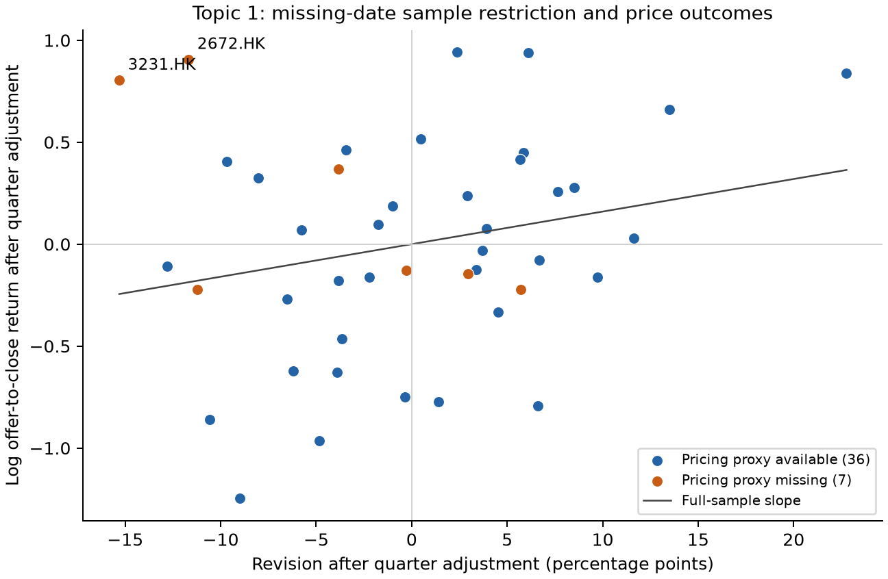

# Topic 1 — Step 3: why missing pricing proxies change the result

Prepared 4 October 2026. Cutoff: 30 September 2026. Working research note,
not a final report. The main sample remains all 43 range-priced IPOs.

## Question

Why does restricting the sample to 36 firms with a recorded pricing proxy
increase the revision coefficient from 1.598 to 3.419? Is the change spread
across the seven excluded firms, or concentrated in a few observations?

## Main finding

Two firms, 2672.HK and 3231.HK, account for **85.2% of the coefficient change**
in exact deletion accounting. Both have negative revision and large positive
first-day returns. They weaken a positive revision–return relationship when
retained. Their absence is not evidence that they should be excluded.

| Issuer | Final price | Filed range | Revision | Opening return | Close return |
| --- | ---: | ---: | ---: | ---: | ---: |
| 2672.HK | HK$15.60 | HK$15.60–20.28 | -13.04% | 291.67% | 367.95% |
| 3231.HK | HK$14.45 | HK$14.45–19.55 | -15.00% | 142.21% | 153.84% |

These cases show that a final price below the midpoint can also coexist with
large listing gains. They do not establish the reason for those gains. A filed
midpoint is not a previously agreed price, and these observations do not prove
an actual price cut during bookbuilding.

## Input checks

For both issuers, the final price matches PDF page 2 of the stored official
allotment text. Recorded endpoints match the stored prospectus extraction.
This endpoint comparison is extraction consistency, not a fresh independent
semantic review of both complete prospectuses.

The first trading-day opening and closing prices match the cached market bars,
which explicitly state `raw_as_traded`:

- 2672.HK, 29 June 2026: opening HK$61.10; close HK$73.00.
- 3231.HK, 9 September 2026: opening HK$35.00; close HK$36.68.

The large returns reproduce from these inputs. The check does not indicate
an adjusted-price mismatch. It is not a new full-source certification.
Source URLs and input hashes are retained in the check table and manifest.

## Diagnostic exclusions: same equation throughout

Each model uses an intercept, revision, Q2 and Q3 indicators. Close, opening
and intraday outcomes are logarithmic. Within a row, all outcomes use the same
firms. Every exclusion is diagnostic; none replaces the main model.

| Retained sample | N | Close coefficient | Opening coefficient | Intraday coefficient | Close HC3 t p |
| --- | ---: | ---: | ---: | ---: | ---: |
| All range offers | 43 | 1.598 | 0.874 | 0.723 | 0.251 |
| Remove 2672 only | 42 | 2.158 | 1.316 | 0.842 | 0.104 |
| Remove 3231 only | 42 | 2.340 | 1.497 | 0.843 | 0.069 |
| Remove both | 41 | 3.014 | 2.031 | 0.983 | 0.007 |
| Remove the other five missing-proxy firms | 38 | 1.734 | 0.993 | 0.740 | 0.262 |
| Remove all seven missing-proxy firms | 36 | 3.419 | 2.369 | 1.050 | 0.008 |

Coefficients are log-return units per one unit of fractional revision. A
+10 pp revision implies a fitted log-return change of 0.1 times the coefficient.
Exploratory HC3 p-values in selected diagnostic samples have no new multiplicity
or wild-cluster correction. A smaller p-value after deleting contrary cases
cannot establish a robust mechanism.

## Exact allocation of the coefficient change

We estimate all **128 subsets** of the seven deletions. For each issuer, we
average its marginal deletion effect over every possible deletion order,
using exact Shapley weights. This is deterministic accounting, not simulation.
It makes the seven contributions sum to the full-to-restricted coefficient
change, and avoids choosing an order that makes one firm appear dominant.

| Missing-proxy issuer | Contribution to close-coefficient increase |
| --- | ---: |
| 3231.HK | 0.8914 |
| 2672.HK | 0.6600 |
| 2261.HK | 0.1253 |
| 6727.HK | 0.0729 |
| 9607.HK | 0.0576 |
| 9615.HK | 0.0133 |
| 0625.HK | 0.0007 |
| Total, using full precision | 1.8212 |

The two leading contributions total 1.5514, or 85.2% of the 1.8212 increase.
This percentage describes the diagnostic coefficient change, not the fraction
of IPO returns caused by these firms or by missing data.

Because log close return equals log opening return plus log intraday return,
the coefficient change also separates exactly: **82.1% occurs in the opening
stage**, with 17.9% in the intraday stage. This locates the statistical change;
it does not identify informed trading or efficient price discovery.

## Availability and interpretation

Six of the seven missing proxies belong to Q3 and one to Q2; none belongs to Q1.
The seven have mean close return 80.80%, but median close return -0.12%.
The available-proxy group has mean 65.85% and median 40.89%. These contrasts
show how misleading a group mean can be when it includes a few very large gains.
They do not prove that the missing-data process is random or non-random.

Quarter controls are retained throughout. They do not eliminate the influence
of unusual firms within a quarter. Excluding firms solely because their expected
pricing dates are missing removes economically relevant counterexamples to a
strong positive partial-adjustment story.

The plot uses revision and log close-return residuals from the **full 43-firm**
quarter-control regressions. Orange points are missing-proxy firms. The line
is the full-sample slope, not a fit selected after excluding contrary cases.

## Research conclusion and next step

The date-anchor result from Step 2 was mostly a sample effect. Step 3 identifies
the main observations behind it and confirms their recorded raw price inputs.
Keep all 43 firms in the main analysis. The positive close-return association
remains uncertain, and a strong result in the selected 36 firms is insufficient
support for partial adjustment.

Next, examine the full-sample opening and intraday relationships with robust
estimation and the declared controls. Test whether the pattern depends on the
mean-regression treatment of large gains. Actual pricing dates remain an evidence
gap; no dates were imputed and no final report is produced at this stage.

## Files and verification

Run `python analysis/pricing_influence_2026.py` from the repository root.
Outputs include issuer profiles, influence diagnostics for all 43 firms,
quarter-adjusted slope contributions, all 128 deletion subsets for each stage,
Shapley contributions, diagnostic models, availability groups, price checks
and a PNG/SVG figure. Source hashes are in `step03_manifest.json`.

Checks pass for exact stage addition, Shapley contribution totals, residual-
regression slope accounting, raw price agreement, and maintained-source lint.
