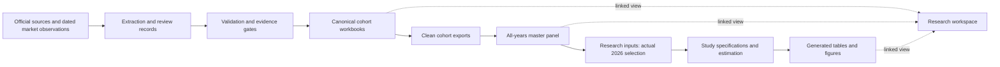

# Project Architecture

Updated: 2 October 2026.

The project has two responsibilities: produce evidence-backed IPO data and analyse a defined research sample. The research workspace gives users a clear view of the resulting files. It does not own their contents.

## Project map

```text
UROP HK IPO/
├── research_workspace/          Daily entry: English names and linked artifacts
├── config/
│   └── research_workspace.json  Declarative artifact catalog
├── tools/
│   └── research_workspace.py    Preflight, create, and verify catalog links
├── run.py                      Root command dispatcher
├── Makefile                    Environment, checks, refresh, and analysis commands
├── analysis/
│   ├── run.py                  Registered studies and sequential execution
│   ├── research_inputs.py      CSV interpretation and explicit 2026 selection
│   ├── specifications/
│   │   └── underpricing.py     Existing hypotheses, model columns, common sample
│   ├── shared/
│   │   ├── inference.py        CR1 covariance and restricted wild bootstrap
│   │   ├── estimation.py       Focused regressions, multiplicity, group diagnostics
│   │   └── reporting.py        Table serialization and chart presentation
│   ├── research_helpers/       Versioned empirical helper implementations
│   ├── *_2026.py              Study-specific analysis and reporting
│   ├── module_*.py            Descriptive and underpricing entry points
│   ├── tests/                 Analysis and orchestration contracts
│   └── out/                   Generated study outputs
├── pipeline/
│   ├── cohorts/               Canonical quarterly Excel workbooks
│   ├── exports/               Clean CSV inputs produced by the pipeline
│   ├── codebooks/             Generated quarterly field descriptions
│   ├── registry/              Generated variable-definition snapshots
│   ├── sources/               Official listing sources and supplements
│   ├── reports/               Evidence reviews, audits, and exclusion logs
│   └── prospectus_pipeline/
│       ├── run.py             Evidence-gated stage orchestration
│       ├── config*.yaml       Cohort and extraction configuration
│       ├── src/               Deterministic pipeline implementations
│       ├── tools/             Collection and maintenance adapters
│       ├── tests/             Pipeline contracts
│       ├── data/              Source evidence, manual records, and market data
│       └── out/               Extraction and validation artifacts
└── docs/                      Research plans, reports, and project guidance
```

`pipeline/run.py` is an existing link to `prospectus_pipeline/run.py`, not another implementation. The LaTeX progress report stays at its current path so the open editor continues to work.

## Interfaces and ownership

| Module | Interface | Implementation and owner |
|---|---|---|
| Root dispatcher | `python run.py <command>` | Delegates to pipeline, study runner, or workspace manager; preserves exit status |
| Pipeline | Existing stages and cohort configs | Source discovery, extraction, deterministic validation, independent review, transactional writeback, exports |
| Research inputs | `select_2026(load_panel())`, `prepare_*` | Registry types, missing values, issuer identity, sample-year validation, shared variables |
| Underpricing specification | `MODELS`, `VARS`, `estimation_sample` | The existing exploratory hypotheses and maximum-specification complete-case policy |
| Inference | `cr1_cov`, `cluster_t`, `wild_cluster_p` | Rank and sample guards, cluster covariance, exact restricted bootstrap |
| Focused estimation | `ols_focus`, `bh_family`, `anova_icc` | Outcome/covariates supplied by caller; HC3 fits, optional wild inference, group diagnostics |
| Reporting | Table serializers and chart style functions | Formatting and presentation; no input loading or sample selection |
| Study runner | `analysis --list`, `analysis --study NAME` | One study registry, established order, isolated processes, stop on failure |
| Research workspace | Catalog plus `workspace [--check]` | Source checks, collision protection, relative links, current artifact access |

Shared implementations must not import report entry points. Study-specific specifications must not become generic inference defaults. Research inputs must not import plotting or estimation modules. The workspace manager uses only the Python standard library and never rewrites scientific data.

The previous names exported by Module A and Module B still refer to the extracted functions. Existing notebooks and tests retain those interfaces without a second implementation.

## Data flow



The master can store multiple years. Each current study selects 2026 explicitly. A linked workbook remains the canonical workbook, so editing it has the same effect as editing the source path.

## Running the project

```bash
# Browse and validate the daily file index.
make workspace
make workspace-check

# Discover analysis names without importing report code or changing outputs.
make analysis-list

# Run selected studies in the registered order.
python run.py analysis --study basic
python run.py analysis --study underpricing
python run.py analysis --study ah --study margin

# Run all studies with the same order used before the refactor.
make analysis

# Existing evidence-gated pipeline commands remain valid.
python run.py status --config prospectus_pipeline/config_2026q3.yaml
python run.py audit --target all --config prospectus_pipeline/config_2026q3.yaml

# Check maintained sources, tests, and registry definitions.
make check-code
```

`analysis --list` and `workspace --check` are read-only. Running a study regenerates that study's outputs. Collection and refresh commands can update data and must retain their existing evidence requirements.

## Adding a study or artifact

For a new study, load data through `research_inputs`, define its own specification and sample policy, and write to a dedicated `analysis/out/<study>/` directory. Register it once in `analysis/run.py`. Document timing, actual N, exclusions, inference, and sources in the generated outputs. Add scientific regression tests when formulas or sample rules change.

For a workspace artifact, add an English `name` and canonical `source` to `config/research_workspace.json`, then run `make workspace`. The manager preflights the complete catalog and refuses missing sources, duplicate destinations, paths outside the project, and conflicting files. Relative links remain usable when the complete project moves.

Variable definitions are authored in `pipeline/prospectus_pipeline/src/variable_catalog.py`, then regenerated into registry and codebooks. Do not treat the linked view or generated metadata as an independent authoring location.

## Scope of this improvement

This refactor separates shared reporting, focused estimation, and clustered inference from report scripts, separates the underpricing specification from its output generation, and centralizes study orchestration and workspace discovery. It does not change estimates, variable definitions, collection gates, or canonical storage paths.

Some specialized studies still reuse event and sample-preparation functions from other studies. They remain explicit dependencies; a complete move of all study-specific event code is not part of this refactor. The pipeline already has path, artifact-contract, state, and workbook-transaction modules; changing all physical directories would add migration risk without solving those dependencies.

See [research entry](RESEARCH_START.md), [artifact placement](REPOSITORY_GUIDE.md), and [pipeline management](../pipeline/SYSTEM_MANAGEMENT.md) for the related scientific and evidence contracts.

PR #28 integration: the separate basic-statistics study is registered as `basic` and runs through `make basic-analysis`; it is not added to the established default full-analysis sequence. The newer research plan and disclosure repairs are preserved.
