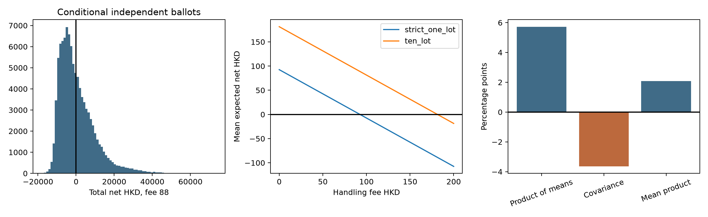

# Retail IPO Applications in Hong Kong: Allocation, Fees and Profit Distributions

Source follow-up on 3 October 2026 supersedes this snapshot's unresolved 2649 lot-size and 3355 Pool B qualifications. The [mentor brief](RETAIL_MENTOR_BRIEF_2026-10-03.md) uses the corrected 113-IPO one-lot sample and no simulation; the [evidence assessment](RETAIL_EVIDENCE_ASSESSMENT_2026-10-03.md) records official clarifications and the 19 total corrections. The earlier simulated results below retain their original definitions.

Updated 3 October 2026. Observation cutoff: 30 September 2026.

## Research scope and principal finding

The population comprises 113 ordinary Hong Kong Main Board IPOs listed from 2 January to 30 September 2026. Headline first-day returns describe gains on allocated securities; they do not describe gains on the full application principal.

At an assumed HK$88 handling fee per IPO, the strict one-lot strategy has a mean expected profit of **HK$4.59 per application** and total expected profit of **HK$514.47**. Its simulated total profit has a median of **HK$-1,730**, with a **57.7%** probability of a portfolio loss. For the 113-IPO one-lot/minimum-tier strategy, the corresponding mean is HK$3.77 and loss probability is 58.1%.

These are expectations and conditional lottery scenarios using observed first-day closing prices. They are not actual account performance, forecasts or causal policy estimates.

## 1. Sample construction: why strict one-lot coverage is 112

The current board-lot record for **2649.HK (ALSCO)** states 200 securities per trading lot. Its disclosed/extracted allocation schedule starts at 500 securities and has no 200-security application tier. The strict one-lot sample therefore contains 112 IPOs; the full-coverage sample uses the 500-security minimum tier for 2649. The unusual 200/500 difference remains a source follow-up item, rather than an assumption that a 500-security application is one trading lot.

Additional specifications cover ten lots, fixed principal budgets, and the minimum-tier sample excluding 3355.HK. For 3355, the published text and the inferred guarantee quantities remain distinguishable in the [provenance appendix](../../analysis/out/retail_distribution/3355_original_and_derived.json). Excluding 3355 is a sensitivity check, not a new independent semantic review.

The frozen tier relation contains 4,582 rows across 113 issuers. The read-time gate verifies the existing independent review's candidate and coverage hashes, source-text hashes, and agreement between candidate and clean economic fields. Arithmetic reconciliation does not itself authorize a semantic review. Re-extraction produces candidates only; changed candidates require a new independent review before use.

## 2. Single applications and repeated participation

For each application, the model uses its guaranteed quantity, additional ballot quantity and disclosed ballot probability. It computes positive, zero and negative net-profit probabilities separately. Portfolio simulations use 100,000 draws, seed 20261003, and independent ballots across IPOs.

| Strategy | Fee (HK$) | IPOs | Mean expected profit per IPO (HK$) | Median total portfolio profit (HK$) | Portfolio loss probability |
|---|---|---|---|---|---|
| Strict one-lot | 0 | 112 | 92.59 | 8,126.00 | 5.69% |
| Strict one-lot | 28 | 112 | 64.59 | 4,990.00 | 21.83% |
| Strict one-lot | 88 | 112 | 4.59 | -1,730.00 | 57.72% |
| Strict one-lot | 100 | 112 | -7.41 | -3,074.00 | 63.15% |
| One-lot / minimum tier | 0 | 113 | 91.77 | 8,059.00 | 5.87% |
| One-lot / minimum tier | 28 | 113 | 63.77 | 4,895.00 | 22.28% |
| One-lot / minimum tier | 88 | 113 | 3.77 | -1,885.00 | 58.13% |
| One-lot / minimum tier | 100 | 113 | -8.23 | -3,241.00 | 63.64% |

The table distinguishes **mean expected profit per IPO** from **median simulated total portfolio profit**. The complete [portfolio table](../../analysis/out/retail_distribution/portfolio_distributions.csv) also reports the expected total, standard deviation, 5th/95th percentiles, negative-expectation share and applicant-level loss probability. These two loss measures have different denominators.

Prices remain fixed at their observed values. The simulation does not capture future market uncertainty, correlation across market returns, overlapping funding requirements or account-specific financing. Fixed budgets constrain subscription principal; handling fees are paid separately. IPOs that cannot be afforded are skipped without a fee. No annualized return is reported.

### Sampling sensitivity, distinct from ballot risk

The following intervals resample listing-month groups 2,000 times. Only nine unequal months are available; these are descriptive sensitivity intervals, not a guarantee of inference under arbitrary market dependence.

| Strategy | IPOs | Months | Mean (HK$) | 95% lower (HK$) | 95% upper (HK$) |
|---|---|---|---|---|---|
| Strict one-lot | 112 | 9 | 4.59 | -50.81 | 64.08 |
| One-lot / minimum tier | 113 | 9 | 3.77 | -51.19 | 63.60 |

## 3. Dependence on a small number of winners

At the HK$88 fee assumption:

| Strategy | Highest-profit IPOs removed | Remaining IPOs | Mean expected profit (HK$) |
|---|---|---|---|
| Strict one-lot | 0 | 112 | 4.59 |
| Strict one-lot | 1 | 111 | -9.89 |
| Strict one-lot | 3 | 109 | -28.98 |
| One-lot / minimum tier | 0 | 113 | 3.77 |
| One-lot / minimum tier | 1 | 112 | -10.59 |
| One-lot / minimum tier | 3 | 110 | -29.52 |

Removing the largest observed gains is an influence diagnostic. It is not an implementable rule for choosing IPOs before returns become known. [All strategy sensitivities](../../analysis/out/retail_distribution/profit_concentration_sensitivity.csv) include fixed-budget and ten-lot applications.

## 4. Allocation and initial returns: a descriptive decomposition

Let a be the expected allocated quantity divided by applied quantity and r the first-day return. With equal IPO weights:

`E[a*r] = E[a]*E[r] + Cov(a, r)`

The covariance uses denominator N. A negative contribution describes the combination of small allocations in high-return IPOs and larger allocations in weaker IPOs. The product of means is an algebraic comparison, not an identified policy counterfactual or proof of investor information types in Rock's model.

| Strategy | Grouping | Group | IPOs | Product of means | Covariance contribution (pp) | Mean capital return |
|---|---|---|---|---|---|---|
| Strict one-lot | all | all | 112 | 5.87% | -3.77 | 2.10% |
| Strict one-lot | cohort | 2026Q1 | 37 | 4.24% | -2.48 | 1.76% |
| Strict one-lot | cohort | 2026Q2 | 45 | 4.97% | -2.00 | 2.98% |
| Strict one-lot | cohort | 2026Q3 | 30 | 3.29% | -2.08 | 1.21% |
| Strict one-lot | ah_true | 0 | 74 | 5.24% | -2.39 | 2.85% |
| Strict one-lot | ah_true | 1 | 38 | 1.77% | -1.13 | 0.64% |
| Strict one-lot | size_group | small | 37 | 4.45% | -1.10 | 3.36% |
| Strict one-lot | size_group | mid | 37 | 3.17% | -1.91 | 1.26% |
| Strict one-lot | size_group | large | 38 | 6.13% | -4.43 | 1.70% |
| One-lot / minimum tier | all | all | 113 | 5.73% | -3.65 | 2.08% |
| One-lot / minimum tier | cohort | 2026Q1 | 38 | 3.89% | -2.17 | 1.71% |
| One-lot / minimum tier | cohort | 2026Q2 | 45 | 4.97% | -2.00 | 2.98% |
| One-lot / minimum tier | cohort | 2026Q3 | 30 | 3.29% | -2.08 | 1.21% |
| One-lot / minimum tier | ah_true | 0 | 75 | 5.07% | -2.25 | 2.81% |
| One-lot / minimum tier | ah_true | 1 | 38 | 1.77% | -1.13 | 0.64% |
| One-lot / minimum tier | size_group | small | 38 | 4.17% | -0.90 | 3.27% |
| One-lot / minimum tier | size_group | mid | 37 | 3.17% | -1.91 | 1.26% |
| One-lot / minimum tier | size_group | large | 38 | 6.13% | -4.43 | 1.70% |

[All decompositions](../../analysis/out/retail_distribution/allocation_return_decomposition.csv) also include the ten-lot strategy. Size groups use the same population cutoffs across strategies. Returns in source CSVs are decimal-scale values; the presentation above converts them to percentages or percentage points.

## 5. Fees, application size and financing

The [fee frontier](../../analysis/out/retail_distribution/fee_frontier.csv) covers handling fees from HK$0 to HK$200. The [application-size schedule](../../analysis/out/retail_distribution/application_size_schedule_fee88.csv) shows every disclosed tier at an assumed HK$88 fee. No tier is selected using its subsequently observed return.

Current channel examples are documented in [Futu's fee schedule](https://www.futuhk.com/en/support/topic2_418from_platform%3D1%26%26lang%3Dzh-hk) and [HSBC's channel FAQ](https://www.hsbc.com.hk/zh-hk/help/faq/investments/), checked on 3 October 2026. Some ordinary subscription channels charge no handling fee; selected bank-financing or branch channels quote HK$100. These current quotes do not establish actual fees paid throughout the research cohort. HK$28 and HK$88 remain hypothetical sensitivity values. See the [fee-source record](../../analysis/out/retail_distribution/fee_sources.json).

The [financing sensitivity](../../analysis/out/retail_distribution/financing_sensitivity.csv) assumes 90% borrowing, 3%/6%/10% annual interest and two/five funded days. These are scenario parameters; FINI settlement does not determine an individual account's loan duration.

All reported net profits subtract only the specified handling and financing costs. Subscription brokerage/levies on allotted securities, sale costs and opportunity cost are excluded. They are therefore partial-cost outcomes rather than complete net investment returns.

## 6. Subscription demand as supporting evidence

The demand regression below controls for offer size, firm age, cornerstone share, quarters and, where applicable, A+H status. It compares the full sample, exclusion of the three largest first-day returns, and non-A+H issuers. Final demand is endogenous and observed after pricing; coefficients are associations.

| Sample | IPOs | Months | Demand coefficient | HC3 SE | HC3 p | 95% lower | 95% upper | Wild-cluster p |
|---|---|---|---|---|---|---|---|---|
| all | 113 | 9 | 0.0895 | 0.0285 | 0.0017 | 0.0335 | 0.1454 | 0.0078 |
| exclude_top3_ir | 110 | 9 | 0.0937 | 0.0254 | 0.0002 | 0.0439 | 0.1435 | 0.0156 |
| non_ah | 75 | 9 | 0.1166 | 0.0453 | 0.0100 | 0.0279 | 0.2053 | 0.0117 |

The aftermarket analysis uses **100 IPOs** with valid raw returns and HSI wealth relatives at both five and twenty trading days. Market-relative return is `(1+BHR)/(1+HSI)-1`, or wealth relative minus one. It differs from an additive abnormal-return measure.

| Demand group | Trading days | IPOs | Months | Median raw BHR | Mean market-relative return | Median market-relative return | Mean: 95% lower | Mean: 95% upper |
|---|---|---|---|---|---|---|---|---|
| all | 5 | 100 | 8 | -0.42% | 2.28% | -0.50% | -1.10% | 6.28% |
| all | 20 | 100 | 8 | -0.31% | 4.40% | -3.20% | -4.50% | 13.14% |
| Low demand | 5 | 29 | 5 | -0.62% | -0.23% | -1.54% | -4.22% | 5.93% |
| Low demand | 20 | 29 | 5 | -6.03% | -0.75% | -6.77% | -14.37% | 12.51% |
| Mid demand | 5 | 36 | 8 | 1.53% | 4.45% | 1.19% | -1.93% | 10.86% |
| Mid demand | 20 | 36 | 8 | 6.87% | 14.96% | 7.55% | 5.82% | 28.70% |
| High demand | 5 | 35 | 8 | -3.97% | 2.13% | -3.46% | -1.98% | 10.75% |
| High demand | 20 | 35 | 8 | -5.74% | -2.19% | -5.21% | -16.50% | 11.92% |

Mean intervals resample listing months. The high-demand group's negative twenty-day mean has an interval spanning zero; these data do not establish a general reversal. All group results are reported together. Final demand terciles are retrospective labels, not a pre-subscription prediction strategy.

## 7. Files and reproducibility



- [Subscription demand baseline](../../analysis/out/subscription_heat/subscription_heat.md)
- [Retail allocation baseline](../../analysis/out/retail_profit/retail_profit.md)
- [Independent A+H price-anchor study](../../analysis/out/ah_anchor/ah_anchor.md)
- [Input/output hashes and package versions](../../analysis/out/retail_distribution/run_manifest.json)
- [Economic tests and review-gate tests](../../analysis/tests/test_retail_distribution.py)

From the project root:

```bash
python run.py analysis --study demand --study allocation_profit --study retail_distribution
python tools/build_empirical_report.py
make check-code
make workspace-check
```

The A+H topic remains separate. This round does not add a causal design or resolve its external-price anomaly. The preceding narrative is preserved as a historical snapshot in [the archive](../../docs/archive/pre-retail-distribution-2026-10-03/EMPIRICAL_RESEARCH_REPORT_2026.md).
